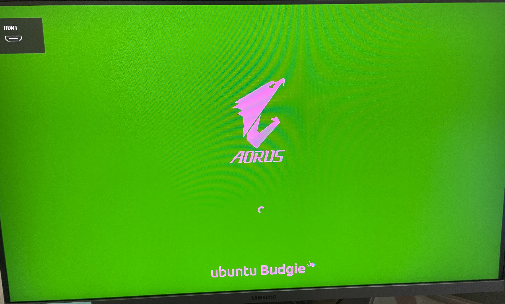

# 從N卡換到A卡的小踩坑
本來想換名子換成「相容性差的A卡與私有接口HDMI這對難兄難弟」，但想想名子太長還是算了，反正就是一個採坑紀錄，日後換卡跟挑螢幕的時候自己多住一點吧

[toc]

# 顯卡更換
我組完新電腦後因為想等新一代的卡所以先拿原本舊的GTX 1660S來用，結果從1月等到現在3月底因為卡荒一直都買不到，所以決定先買一張卡來代替用，至少先升級，後續如果真的其他原因沒辦法買卡也還有足夠的性能。

我在3/25買了Acer Predator BiForst RX 6700，全新不到9k，加上A卡在Linux有更好的相容性，在KVM上雖然是也有給ChatGPT分析，但確實結合自己所聽聞的A卡在Linux相容性會更好，再加上這張卡的獨特設計（渦扇＋吹透）讓我選了這張卡

# 螢幕顯示異常
先說一下，AMD的顯示卡雖然在Linux相容性上好到不打驅動就能跑得很好，但最好還是要打，特別是你要使用諸如ROCm等比較進階的應用。

## 卸載驅動
我還是非常意外的，我在剛安裝完我的RX 6700後，我甚至原本的NVIDIA Driver都還沒卸載，別說進了系統非常順暢，打開遊戲後FPS也得到大幅提昇，並且透過指令檢查RX 6700正常載入，不過保險起見還是將NVIDIA驅動刪除，刪除後重新開機卻發生了異常，首先是螢幕順序與顯示問題，原本是我的ProArt會先被讀取到並顯示Logo，但在刪除完驅動後重開機變成了我的副螢幕先讀取到，然後顏色異常，如下圖：

更遭的是，進入登入畫面後我的副螢幕不會亮，動滑鼠也會變得異常卡頓

## Windows重新初始化與驅動安裝
我首先先想到了雙系統Windows會污染Ubuntu的問題，我一切換到Windows這個嚴重的「綠偏」依舊持續，並且由於顯示卡不只換了，連牌子也不一樣，所以分辨率也失常，過個幾分鐘它就自己調適完畢，我迅速的將N卡驅動卸載，並安裝AMD的驅動，把一切打理好，簡單測試了下遊戲沒問題，重開機後就正常了，至少在我斷電之前是這想的...

此時都是正常的，直到我因為某些原因，把電腦斷電後這個問題又來了...

## 安裝驅動
問題重現後又花了一段時間找解法，結果發現AMD的顯示卡驅動雖然在Linux有內置，但還是需要安裝取得新功能和Bug修復，安裝完後重起就又看起來正常了，鎖定畫面亮起來時我的副螢幕也是正常顯示

因為早些時候就是斷電導致問題複現，所以我又把電腦斷電一次，問題又出現了

## 問題複現
又經歷了一些修復問題的方法，但只剩關閉部份顯示卡功能或者Kernel降級這些方法，並且利用`sudo dmesg | grep -i amdgpu`得到的問題基本都是EDID的讀取錯誤，最後如果用重新啟動進入系統或者剛關機間隔沒有太久就開機是沒問題的。除此之外前幾次的解決方案並沒有解決令一個問題：無法正常讓螢幕熄滅，一樣的指令得到的Log似乎指向寄存器的等待超時，我梳理後發現問題集中在我的副螢幕上，並留意到我是使用2種不同的接口，我的主螢幕是DP，副螢幕是HDMI，我也嘗試過只單獨接一個螢幕，基本都沒大問題，2個都接到顯示卡後才有問題，我順著AMD HDMI的問題搜尋發現網路上也有相關案例，這個問題一旦發生在Windows很多人基本開不了機，而且Linux也不少案例，基本症狀都是HDMI螢幕滑鼠軌跡很慢，或者像我這種乾脆不亮的，好在基本不影響正常使用，所以在找到更合適或者Kernel更先前就放著吧，真的不行在花時間尋找合適的Kernel降級避免問題吧。

附上問題Log:
```bash
# 從進入系統到登入的Log
[    4.206237] [drm] amdgpu kernel modesetting enabled.
[    4.206238] [drm] amdgpu version: 6.10.5
[    4.206254] amdgpu: vga_switcheroo: detected switching method \_SB_.PCI0.GP17.VGA_.ATPX handle
[    4.206358] amdgpu: ATPX version 1, functions 0x00000000
[    4.209561] amdgpu: Virtual CRAT table created for CPU
[    4.209566] amdgpu: Topology: Add CPU node
[    4.211070] amdgpu 0000:03:00.0: enabling device (0006 -> 0007)
[    4.214516] amdgpu 0000:03:00.0: amdgpu: Fetched VBIOS from VFCT
[    4.214517] amdgpu: ATOM BIOS: 113-EXT88196-100
[    4.216524] amdgpu 0000:03:00.0: amdgpu: CP RS64 enable
[    4.246586] amdgpu 0000:03:00.0: vgaarb: deactivate vga console
[    4.246588] amdgpu 0000:03:00.0: amdgpu: Trusted Memory Zone (TMZ) feature not supported
[    4.246624] amdgpu 0000:03:00.0: amdgpu: VRAM: 8176M 0x0000008000000000 - 0x00000081FEFFFFFF (8176M used)
[    4.246625] amdgpu 0000:03:00.0: amdgpu: GART: 512M 0x00007FFF00000000 - 0x00007FFF1FFFFFFF
[    4.246698] [drm] amdgpu: 8176M of VRAM memory ready
[    4.246700] [drm] amdgpu: 15595M of GTT memory ready.
[    4.303584] amdgpu 0000:03:00.0: amdgpu: reserve 0x1300000 from 0x81fc000000 for PSP TMR
[    4.397581] amdgpu 0000:03:00.0: amdgpu: RAS: optional ras ta ucode is not available
[    4.405090] amdgpu 0000:03:00.0: amdgpu: RAP: optional rap ta ucode is not available
[    4.405090] amdgpu 0000:03:00.0: amdgpu: SECUREDISPLAY: securedisplay ta ucode is not available
[    4.405115] amdgpu 0000:03:00.0: amdgpu: smu driver if version = 0x00000035, smu fw if version = 0x00000040, smu fw program = 0, smu fw version = 0x00525c00 (82.92.0)
[    4.405117] amdgpu 0000:03:00.0: amdgpu: SMU driver if version not matched
[    4.458398] amdgpu 0000:03:00.0: amdgpu: SMU is initialized successfully!
[    4.852586] amdgpu: HMM registered 8176MB device memory
[    4.853418] kfd kfd: amdgpu: Allocated 3969056 bytes on gart
[    4.853430] kfd kfd: amdgpu: Total number of KFD nodes to be created: 1
[    4.853451] amdgpu: Virtual CRAT table created for GPU
[    4.853502] amdgpu: Topology: Add dGPU node [0x7480:0x1002]
[    4.853503] kfd kfd: amdgpu: added device 1002:7480
[    4.853514] amdgpu 0000:03:00.0: amdgpu: SE 2, SH per SE 2, CU per SH 8, active_cu_number 32
[    4.853516] amdgpu 0000:03:00.0: amdgpu: ring gfx_0.0.0 uses VM inv eng 0 on hub 0
[    4.853517] amdgpu 0000:03:00.0: amdgpu: ring comp_1.0.0 uses VM inv eng 1 on hub 0
[    4.853518] amdgpu 0000:03:00.0: amdgpu: ring comp_1.1.0 uses VM inv eng 4 on hub 0
[    4.853518] amdgpu 0000:03:00.0: amdgpu: ring comp_1.2.0 uses VM inv eng 6 on hub 0
[    4.853519] amdgpu 0000:03:00.0: amdgpu: ring comp_1.3.0 uses VM inv eng 7 on hub 0
[    4.853519] amdgpu 0000:03:00.0: amdgpu: ring comp_1.0.1 uses VM inv eng 8 on hub 0
[    4.853519] amdgpu 0000:03:00.0: amdgpu: ring comp_1.1.1 uses VM inv eng 9 on hub 0
[    4.853520] amdgpu 0000:03:00.0: amdgpu: ring comp_1.2.1 uses VM inv eng 10 on hub 0
[    4.853520] amdgpu 0000:03:00.0: amdgpu: ring comp_1.3.1 uses VM inv eng 11 on hub 0
[    4.853521] amdgpu 0000:03:00.0: amdgpu: ring sdma0 uses VM inv eng 12 on hub 0
[    4.853521] amdgpu 0000:03:00.0: amdgpu: ring sdma1 uses VM inv eng 13 on hub 0
[    4.853521] amdgpu 0000:03:00.0: amdgpu: ring vcn_unified_0 uses VM inv eng 0 on hub 8
[    4.853522] amdgpu 0000:03:00.0: amdgpu: ring jpeg_dec uses VM inv eng 1 on hub 8
[    4.853522] amdgpu 0000:03:00.0: amdgpu: ring mes_kiq_3.1.0 uses VM inv eng 14 on hub 0
[    4.857506] amdgpu 0000:03:00.0: amdgpu: Using BACO for runtime pm
[    4.857730] [drm] Initialized amdgpu 3.59.0 for 0000:03:00.0 on minor 1
[    4.862384] fbcon: amdgpudrmfb (fb0) is primary device
[    4.862387] amdgpu 0000:03:00.0: [drm] fb0: amdgpudrmfb frame buffer device
[    4.883753] amdgpu 0000:75:00.0: enabling device (0006 -> 0007)
[    4.885301] amdgpu 0000:75:00.0: amdgpu: Fetched VBIOS from VFCT
[    4.885302] amdgpu: ATOM BIOS: 102-RAPHAEL-008
[    4.889835] amdgpu 0000:75:00.0: amdgpu: Trusted Memory Zone (TMZ) feature disabled as experimental (default)
[    4.889863] amdgpu 0000:75:00.0: amdgpu: VRAM: 512M 0x000000F400000000 - 0x000000F41FFFFFFF (512M used)
[    4.889864] amdgpu 0000:75:00.0: amdgpu: GART: 1024M 0x0000000000000000 - 0x000000003FFFFFFF
[    4.889933] [drm] amdgpu: 512M of VRAM memory ready
[    4.889934] [drm] amdgpu: 15595M of GTT memory ready.
[    4.912564] amdgpu 0000:75:00.0: amdgpu: reserve 0xa00000 from 0xf41e000000 for PSP TMR
[    4.974562] amdgpu 0000:75:00.0: amdgpu: RAS: optional ras ta ucode is not available
[    4.979967] amdgpu 0000:75:00.0: amdgpu: RAP: optional rap ta ucode is not available
[    4.979967] amdgpu 0000:75:00.0: amdgpu: SECUREDISPLAY: securedisplay ta ucode is not available
[    4.981631] amdgpu 0000:75:00.0: amdgpu: SMU is initialized successfully!
[    4.986569] kfd kfd: amdgpu: Allocated 3969056 bytes on gart
[    4.986575] kfd kfd: amdgpu: Total number of KFD nodes to be created: 1
[    4.986706] amdgpu: Virtual CRAT table created for GPU
[    4.986844] amdgpu: Topology: Add dGPU node [0x13c0:0x1002]
[    4.986844] kfd kfd: amdgpu: added device 1002:13c0
[    4.986852] amdgpu 0000:75:00.0: amdgpu: SE 1, SH per SE 1, CU per SH 2, active_cu_number 2
[    4.986854] amdgpu 0000:75:00.0: amdgpu: ring gfx_0.0.0 uses VM inv eng 0 on hub 0
[    4.986855] amdgpu 0000:75:00.0: amdgpu: ring gfx_0.1.0 uses VM inv eng 1 on hub 0
[    4.986855] amdgpu 0000:75:00.0: amdgpu: ring comp_1.0.0 uses VM inv eng 4 on hub 0
[    4.986856] amdgpu 0000:75:00.0: amdgpu: ring comp_1.1.0 uses VM inv eng 5 on hub 0
[    4.986856] amdgpu 0000:75:00.0: amdgpu: ring comp_1.2.0 uses VM inv eng 6 on hub 0
[    4.986856] amdgpu 0000:75:00.0: amdgpu: ring comp_1.3.0 uses VM inv eng 7 on hub 0
[    4.986857] amdgpu 0000:75:00.0: amdgpu: ring comp_1.0.1 uses VM inv eng 8 on hub 0
[    4.986857] amdgpu 0000:75:00.0: amdgpu: ring comp_1.1.1 uses VM inv eng 9 on hub 0
[    4.986857] amdgpu 0000:75:00.0: amdgpu: ring comp_1.2.1 uses VM inv eng 10 on hub 0
[    4.986858] amdgpu 0000:75:00.0: amdgpu: ring comp_1.3.1 uses VM inv eng 11 on hub 0
[    4.986858] amdgpu 0000:75:00.0: amdgpu: ring kiq_0.2.1.0 uses VM inv eng 12 on hub 0
[    4.986859] amdgpu 0000:75:00.0: amdgpu: ring sdma0 uses VM inv eng 13 on hub 0
[    4.986859] amdgpu 0000:75:00.0: amdgpu: ring vcn_dec_0 uses VM inv eng 0 on hub 8
[    4.986859] amdgpu 0000:75:00.0: amdgpu: ring vcn_enc_0.0 uses VM inv eng 1 on hub 8
[    4.986860] amdgpu 0000:75:00.0: amdgpu: ring vcn_enc_0.1 uses VM inv eng 4 on hub 8
[    4.986860] amdgpu 0000:75:00.0: amdgpu: ring jpeg_dec uses VM inv eng 5 on hub 8
[    4.987066] amdgpu 0000:75:00.0: amdgpu: Runtime PM not available
[    4.987228] [drm] Initialized amdgpu 3.59.0 for 0000:75:00.0 on minor 0
[    4.990067] amdgpu 0000:75:00.0: [drm] Cannot find any crtc or sizes
[    8.984792] snd_hda_intel 0000:03:00.1: bound 0000:03:00.0 (ops amdgpu_dm_audio_component_bind_ops [amdgpu])
[    8.985317] snd_hda_intel 0000:75:00.1: bound 0000:75:00.0 (ops amdgpu_dm_audio_component_bind_ops [amdgpu])
[   12.478108] amdgpu 0000:03:00.0: vgaarb: VGA decodes changed: olddecodes=io+mem,decodes=none:owns=none
[   12.478111] amdgpu 0000:75:00.0: vgaarb: VGA decodes changed: olddecodes=io+mem,decodes=none:owns=none
[   19.783371] workqueue: dm_irq_work_func [amdgpu] hogged CPU for >10000us 4 times, consider switching to WQ_UNBOUND
[   20.029431] amdgpu 0000:03:00.0: amdgpu: [drm] *ERROR* dc_dmub_srv_log_diagnostic_data: DMCUB error - collecting diagnostic data
[   20.029463] [drm:parse_hdmi_amd_vsdb [amdgpu]] *ERROR* EDID CEA parser failed
[   20.259631] amdgpu 0000:03:00.0: amdgpu: [drm] *ERROR* dc_dmub_srv_log_diagnostic_data: DMCUB error - collecting diagnostic data
[   20.489554] amdgpu 0000:03:00.0: amdgpu: [drm] *ERROR* dc_dmub_srv_log_diagnostic_data: DMCUB error - collecting diagnostic data
[   20.737942] amdgpu 0000:03:00.0: amdgpu: [drm] *ERROR* dc_dmub_srv_log_diagnostic_data: DMCUB error - collecting diagnostic data
[   20.737974] [drm:parse_hdmi_amd_vsdb [amdgpu]] *ERROR* EDID CEA parser failed
[   20.970923] amdgpu 0000:03:00.0: amdgpu: [drm] *ERROR* dc_dmub_srv_log_diagnostic_data: DMCUB error - collecting diagnostic data
[   20.970955] [drm:parse_hdmi_amd_vsdb [amdgpu]] *ERROR* EDID CEA parser failed
[   21.813688] amdgpu 0000:03:00.0: amdgpu: [drm] *ERROR* dc_dmub_srv_log_diagnostic_data: DMCUB error - collecting diagnostic data
[   21.813722] [drm:parse_hdmi_amd_vsdb [amdgpu]] *ERROR* EDID CEA parser failed
[   22.041624] amdgpu 0000:03:00.0: amdgpu: [drm] *ERROR* dc_dmub_srv_log_diagnostic_data: DMCUB error - collecting diagnostic data
[   22.041656] [drm:parse_hdmi_amd_vsdb [amdgpu]] *ERROR* EDID CEA parser failed
[   22.408733] amdgpu 0000:03:00.0: amdgpu: [drm] *ERROR* dc_dmub_srv_log_diagnostic_data: DMCUB error - collecting diagnostic data

# 螢幕熄滅馬上喚醒
[  347.203226] amdgpu 0000:03:00.0: amdgpu: [drm] REG_WAIT timeout 1us * 100 tries - dcn32_program_compbuf_size line:139
```

# 總結
NVIDIA顯示卡雖然閉源，但若不是使用Wayland或者使用KVM需要直通並且恢復到宿主主機的情況，NVIDIA顯示卡普片來說更加穩定，即使AMD有開源驅動，某方面來說他們的顯示卡情況很不穩定，以我手上的RX 6700來說，據說只有撼訊PowerColor的沒有發生HDMI相容性問題
