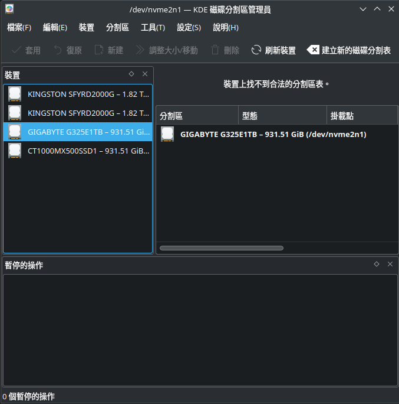

# 移除Windows全紀錄
自從我在我的遊戲碟設定好BTRFS Subvolume後，我就在也沒開過Windows了，我在[Ubuntu用了1年又1月的心得](./Ubuntu用了1年又1月的心得.md)那篇有說我當時2個月沒開Windows，當時大概是2月上旬，到現在都5月初了，所以也差不多4、5個月沒開Windows，現在SSD價格居高不下的時刻我白白讓1T因為有Windows的存在所以不用，有點過意不去，雖然是QLC SSD，但有1T是1T對吧？

那在移除Windows時，因為我已經把Boot Manager已經獨立到這顆SSD上了，並且NVRAM也指向了這個Bootloader，所以我在移除Windows時候必須先把NVRAM的指向移除，那這樣整個Windows刪除流程是這樣：
> 搬資料 -> 移除EFI條目 -> 抹除SSD -> 格式化\
具體搬的資料是甚麼？看個人，我只搬了Downloads和螢幕擷圖，有的人會想直接搬整個系統，那這個時候我建議用其他軟體把整個Windows重新讀取轉成`.vmdk`或者`.qcow2`，這裡就不說明了。

# 刪除NVRAM指向
如果不刪除NVRAM上面的Boot Order有可能主機板在POST的時候因為讀取空白位置導致開機異常(可以參考我之前的Code 99事件)，所以最好在抹除整個系統之前先把Boot Order從UEFI上面刪掉。

對於UEFI NVRAM的操作在Linux上統一是由`efibootmgr`指令作為前端去操作，它會影響到`/sys/firmware/efi/efivars/`的檔案，我們等等會交叉比對。

那你要確認你目前電腦有哪些Bootloader你直接輸入`efibootmgr`就可以了：
```bash
$ efibootmgr
BootCurrent: 0002
Timeout: 1 seconds
BootOrder: 0002,0001
Boot0001* Windows Boot Manager  HD(3,GPT,68d7479f-1a17-42de-bfee-51fc9080068c,0x74487000,0x100000)/File(\EFI\Microsoft\Boot\bootmgfw.efi)57494e444f5753000100000088000000780000004200430044004f0042004a004500430054003d007b00390064006500610038003600320063002d0035006300640064002d0034006500370030002d0061006300630031002d006600330032006200330034003400640034003700390035007d00000024400100000010000000040000007fff0400
Boot0002* Ubuntu        HD(1,GPT,8aa23fd2-b0ba-48f4-8411-fab5fd7837bb,0x800,0x219800)/File(\EFI\ubuntu\shimx64.efi)

# 額外驗證
$ ls -l /sys/firmware/efi/efivars/ | grep Boot000
-rw-r--r-- 1 root root  304  5月  2 13:41 Boot0001-8be4df61-93ca-11d2-aa0d-00e098032b8c
-rw-r--r-- 1 root root  122  5月  2 13:41 Boot0002-8be4df61-93ca-11d2-aa0d-00e098032b8c
```
`efibootmgr`會把當前有的Bootloader和啟動順序給列出來，那我們可以看到`Boot0001`就是Windows Boot Manager，記住這個編號，我們要來拿起屠刀了，刪除Boot Order的指令如下：
```bash
efibootmgr -b $ORDER -B
```
`-b`是宣告要修改後面指定的`$ORDER`的Binary，然後`-B`是直接移除，所以套用到我的情境就是`efibootmgr -b 0001 -B`，查看的時候可以不用`sudo`，刪除的時候要加`sudo`。\
刪除的時候會列出來當前Boot Order，你也可以再輸入一次`efibootmgr`確認
```bash
$ sudo efibootmgr -b 0001 -B
BootCurrent: 0002
Timeout: 1 seconds
BootOrder: 0002
Boot0002* Ubuntu        HD(1,GPT,8aa23fd2-b0ba-48f4-8411-fab5fd7837bb,0x800,0x219800)/File(\EFI\ubuntu\shimx64.efi)
$ efibootmgr 
BootCurrent: 0002
Timeout: 1 seconds
BootOrder: 0002
Boot0002* Ubuntu        HD(1,GPT,8aa23fd2-b0ba-48f4-8411-fab5fd7837bb,0x800,0x219800)/File(\EFI\ubuntu\shimx64.efi)
```
接下來檢查`/sys/firmware/efi/efivars/`是不是有真的被影響：
```bash
$ ls -l /sys/firmware/efi/efivars/ | grep Boot000
-rw-r--r-- 1 root root  122  5月  2 13:41 Boot0002-8be4df61-93ca-11d2-aa0d-00e098032b8c
```
如果過程你有關機記得斷電(尚未嘗試)，如果你直接重新開機主機板POST後會把Windows Boot Manager重新加入到NVRAM，可以的話盡量移除後趕快把Windows和Boot Manager從硬碟上面刪除。

## 刪除Windows時的無聊觀察
因為在跟Claude Sonnet討論時太好奇了，所以問了很多細節，考慮到有人也只是單純想移除系統對這段觀察沒有興趣，所以我把接下來下一步放在[這裡](#secure-erase-ssd)，有興趣再來讀下面內容。

### efibootmgr -v的資訊
如果你想進一步知道BootLoader在NVRAM的資訊，可以加上`-v`這個參數
```bash
$ efibootmgr -v
BootCurrent: 0002
Timeout: 1 seconds
BootOrder: 0002,0001
Boot0001* Windows Boot Manager  HD(3,GPT,68d7479f-1a17-42de-bfee-51fc9080068c,0x74487000,0x100000)/File(\EFI\Microsoft\Boot\bootmgfw.efi)57494e444f5753000100000088000000780000004200430044004f0042004a004500430054003d007b00390064006500610038003600320063002d0035006300640064002d0034006500370030002d0061006300630031002d006600330032006200330034003400640034003700390035007d00000024400100000010000000040000007fff0400
      dp: 04 01 2a 00 03 00 00 00 00 70 48 74 00 00 00 00 00 00 10 00 00 00 00 00 9f 47 d7 68 17 1a de 42 bf ee 51 fc 90 80 06 8c 02 02 / 04 04 46 00 5c 00 45 00 46 00 49 00 5c 00 4d 00 69 00 63 00 72 00 6f 00 73 00 6f 00 66 00 74 00 5c 00 42 00 6f 00 6f 00 74 00 5c 00 62 00 6f 00 6f 00 74 00 6d 00 67 00 66 00 77 00 2e 00 65 00 66 00 69 00 00 00 / 7f ff 04 00
    data: 57 49 4e 44 4f 57 53 00 01 00 00 00 88 00 00 00 78 00 00 00 42 00 43 00 44 00 4f 00 42 00 4a 00 45 00 43 00 54 00 3d 00 7b 00 39 00 64 00 65 00 61 00 38 00 36 00 32 00 63 00 2d 00 35 00 63 00 64 00 64 00 2d 00 34 00 65 00 37 00 30 00 2d 00 61 00 63 00 63 00 31 00 2d 00 66 00 33 00 32 00 62 00 33 00 34 00 34 00 64 00 34 00 37 00 39 00 35 00 7d 00 00 00 24 40 01 00 00 00 10 00 00 00 04 00 00 00 7f ff 04 00
Boot0002* Ubuntu        HD(1,GPT,8aa23fd2-b0ba-48f4-8411-fab5fd7837bb,0x800,0x219800)/File(\EFI\ubuntu\shimx64.efi)
      dp: 04 01 2a 00 01 00 00 00 00 08 00 00 00 00 00 00 00 98 21 00 00 00 00 00 d2 3f a2 8a ba b0 f4 48 84 11 fa b5 fd 78 37 bb 02 02 / 04 04 34 00 5c 00 45 00 46 00 49 00 5c 00 75 00 62 00 75 00 6e 00 74 00 75 00 5c 00 73 00 68 00 69 00 6d 00 78 00 36 00 34 00 2e 00 65 00 66 00 69 00 00 00 / 7f ff 04 00
```
對比沒有加`-v`的輸出多了`dp:`和`data`(Windows)的欄位，這些是給機器看的Bytes資料，由於這些資料都是純二進制(`file`的結果是`data`)，所以其實不適合直接給人讀，如果你真的想看，可以用`xxd`來閱讀檔案，你就會理解這些資料在不同資料段是怎麼被`efibootmgr`解析的：
```bash
$ xxd /sys/firmware/efi/efivars/Boot0001-8be4df61-93ca-11d2-aa0d-00e098032b8c 
00000000: 0700 0000 0100 0000 7400 5700 6900 6e00  ........t.W.i.n.
00000010: 6400 6f00 7700 7300 2000 4200 6f00 6f00  d.o.w.s. .B.o.o.
00000020: 7400 2000 4d00 6100 6e00 6100 6700 6500  t. .M.a.n.a.g.e.
00000030: 7200 0000 0401 2a00 0300 0000 0070 4874  r.....*......pHt
00000040: 0000 0000 0000 1000 0000 0000 9f47 d768  .............G.h
00000050: 171a de42 bfee 51fc 9080 068c 0202 0404  ...B..Q.........
00000060: 4600 5c00 4500 4600 4900 5c00 4d00 6900  F.\.E.F.I.\.M.i.
00000070: 6300 7200 6f00 7300 6f00 6600 7400 5c00  c.r.o.s.o.f.t.\.
00000080: 4200 6f00 6f00 7400 5c00 6200 6f00 6f00  B.o.o.t.\.b.o.o.
00000090: 7400 6d00 6700 6600 7700 2e00 6500 6600  t.m.g.f.w...e.f.
000000a0: 6900 0000 7fff 0400 5749 4e44 4f57 5300  i.......WINDOWS.
000000b0: 0100 0000 8800 0000 7800 0000 4200 4300  ........x...B.C.
000000c0: 4400 4f00 4200 4a00 4500 4300 5400 3d00  D.O.B.J.E.C.T.=.
000000d0: 7b00 3900 6400 6500 6100 3800 3600 3200  {.9.d.e.a.8.6.2.
000000e0: 6300 2d00 3500 6300 6400 6400 2d00 3400  c.-.5.c.d.d.-.4.
000000f0: 6500 3700 3000 2d00 6100 6300 6300 3100  e.7.0.-.a.c.c.1.
00000100: 2d00 6600 3300 3200 6200 3300 3400 3400  -.f.3.2.b.3.4.4.
00000110: 6400 3400 3700 3900 3500 7d00 0000 2440  d.4.7.9.5.}...$@
00000120: 0100 0000 1000 0000 0400 0000 7fff 0400  ................
$ xxd /sys/firmware/efi/efivars/Boot0002-8be4df61-93ca-11d2-aa0d-00e098032b8c 
00000000: 0700 0000 0100 0000 6200 5500 6200 7500  ........b.U.b.u.
00000010: 6e00 7400 7500 0000 0401 2a00 0100 0000  n.t.u.....*.....
00000020: 0008 0000 0000 0000 0098 2100 0000 0000  ..........!.....
00000030: d23f a28a bab0 f448 8411 fab5 fd78 37bb  .?.....H.....x7.
00000040: 0202 0404 3400 5c00 4500 4600 4900 5c00  ....4.\.E.F.I.\.
00000050: 7500 6200 7500 6e00 7400 7500 5c00 7300  u.b.u.n.t.u.\.s.
00000060: 6800 6900 6d00 7800 3600 3400 2e00 6500  h.i.m.x.6.4...e.
00000070: 6600 6900 0000 7fff 0400                 f.i.......
```
那說回`efibootmgr -v`，你會發現`dp`的欄位會突然冒出斜線`/`，這是切分資料段的方式，`dp`的全稱是Device Path，你可以看到一個`dp`被切成三段，大致如下：
1. GPT分區定位資訊，裡面有磁碟 GUID、分區起始 LBA、大小
2. EFI檔案路徑也就是`\EFI\Microsoft\Boot\bootmgfw.efi`和`\EFI\ubuntu\shimx64.efi`
3. `7fff 0400 `，End of Hardware Device Path

所以你可以發現，Windows Boot Manager是兩段檔案拼在一起的，後面的附加資料是UEFI標準有`Device Path List`(也就是`shimx64.efi`或`bootmgfw.efi`)後面有個`Optional Data`欄位，這段資料是非強制的，所以Ubuntu就沒有這段資料，而Windows Boot Manager實際上是由`bootmgfw.efi`作為入口然後由`bootmgfw.efi`讀取`Optional Data`找到BCD (Boot Configuration Data，之前搬移EFI重建Windows Boot Manager就是用`bcdboot`)去開始自我驗證、顯示開機動畫以及最後交給`winload.efi`完成Windows開機。

這麼做的效果是安全性的提昇以及可以在Boot時做複雜的事情(WDDM到來後顯示開機動畫、檢查`winload.efi`、多Windows版本啟動等)，但是代價就是你需要進入Windows或者用Windows PE才可以修改BCD(本質上BCD其實也是Registry hive，Windows到了Vista整個註冊表機制已經用得很純熟了)。\
對比之下Linux則是接力棒的概念，以Ubuntu來說就是shim -> MoK和GRUB -> initramfs -> Kernel -> OS，如果要做到完全的Secure Boot就是firmware (Secure Boot on) -> systemd-boot -> UJI.efi -> TPM PCR unsealing（systemd-cryptenroll）-> LUKS decrypto -> dm-verity保護rootfs -> OS\
確實大家都是Do one thing，每個都很簡單，但是使用者或維護者要自己串在一起，這又是All in one和Do one thing的哲學區別，當然會有這個區別不單純是技術選型的問題，也跟Windows和Linux的生態系有關。

### UEFI與Linux的通訊
我在前面的章節提到了`efibootmgr`會影響`/sys/firmware/efi/efivars/`，那這裡是甚麼樣的地方？\
這裡是主機板的NVRAM，準確來說是SPI Flash，BootOrder和SecureBoot等資訊都會存在這裡，你可以直接`ls`，那大致上會看到這類格式：
```bash
/sys/firmware/efi/efivars/Vars-GUID

# Vars-uuid ex:
Boot0001-8be4df61-93ca-11d2-aa0d-00e098032b8c
Boot0002-8be4df61-93ca-11d2-aa0d-00e098032b8c
BootCurrent-8be4df61-93ca-11d2-aa0d-00e098032b8c
BootOptionSupport-8be4df61-93ca-11d2-aa0d-00e098032b8c
BootOrder-8be4df61-93ca-11d2-aa0d-00e098032b8c
```
你可能會好奇OS是怎麼知道主機板的UEFI vars，畢竟各家UEFI甚至BIOS再經歷CHI病毒後過段時間大家都走向私有化了。\
其實這一小塊是專門放主機板和OS會頻繁交換資料的地方，比如BootOrder和SecureBoot，而且後面的GUID甚至是有規律的，比如：
- UEFI強制規範的標準：
  - `8be4df61-93ca-11d2-aa0d-00e098032b8c`: 包括BootOrder、SecureBoot (是否啟用)、`OsIndications`等。
- 業界實做標準(但是不在UEFI標準內)：
  - `605dab50-e046-4300-abb6-3dd810dd8b23`: shim / MOK機制，比如`MokList`、`MokSBState`等。
  - `77fa9abd-0359-4d32-bd60-28f4e78f784b`: Microsoft，比如`CurrentPolicy`。
- 廠商私有標準：比如`AMITCGPPIVAR-a8a2093b-fefa-43c1-8e62-ce526847265e`，真正最讓人難以理解的東西。

上面的檔案全部都是二進制檔案，你直接用`file`檢查會得到`data`的輸出：
```bash
$ file /sys/firmware/efi/efivars/Boot0001-8be4df61-93ca-11d2-aa0d-00e098032b8c 
/sys/firmware/efi/efivars/Boot0001-8be4df61-93ca-11d2-aa0d-00e098032b8c: data
```
基本上你如果要初步查看，只能用`xxd`去看他們的Bytes怎麼排，要修改就要用[UEFI Editor](https://github.com/BoringBoredom/UEFI-Editor)或者是[RU.EFU](https://ruexe.blogspot.com/)了。

這只解釋了主機板和OS為甚麼會共用，但沒解釋他們是怎麼通訊的，接下來來說兩者怎麼溝通的。\
他們的通訊方式是透過UEFI Runtime Variable API (SetVariable / GetVariable)來獲取上面的內容，這個API在Linux是一個Kernel的Mapping而已，這個地方一修改就會同步映射到NVRAM上面，沒有undo(返回)和 dry-run(試跑)，一旦改錯清則要進入UEFI重新設定，重則需要拔除CMOS、reflush UEFI甚至變磚都不是不可能，所以沒事別碰這裡，乖乖用`efibootmgr`或者`grub-install`之類的工具幫我們處理NVRAM上的操作就好。

那Linux的VFS在處理NVRAM的部份時，出於安全性甚至會額外給這目錄的大部分檔案上禁止修改的tag：
```bash
$ lsattr /sys/firmware/efi/efivars/ | head
----i----------------- /sys/firmware/efi/efivars/LoaderDevicePartUUID-4a67b082-0a4c-41cf-b6c7-440b29bb8c4f
----i----------------- /sys/firmware/efi/efivars/LoaderInfo-4a67b082-0a4c-41cf-b6c7-440b29bb8c4f
----i----------------- /sys/firmware/efi/efivars/MokListTrustedRT-605dab50-e046-4300-abb6-3dd810dd8b23
----i----------------- /sys/firmware/efi/efivars/SbatLevelRT-605dab50-e046-4300-abb6-3dd810dd8b23
----i----------------- /sys/firmware/efi/efivars/MokListXRT-605dab50-e046-4300-abb6-3dd810dd8b23
----i----------------- /sys/firmware/efi/efivars/MokListRT-605dab50-e046-4300-abb6-3dd810dd8b23
----i----------------- /sys/firmware/efi/efivars/HiiDB-1b838190-4625-4ead-abc9-cd5e6af18fe0
---------------------- /sys/firmware/efi/efivars/BootCurrent-8be4df61-93ca-11d2-aa0d-00e098032b8c
----i----------------- /sys/firmware/efi/efivars/PlatformLangCodes-8be4df61-93ca-11d2-aa0d-00e098032b8c
---------------------- /sys/firmware/efi/efivars/ErrOutDev-8be4df61-93ca-11d2-aa0d-00e098032b8c
```
會這麼做的原因是避免部份套件(甚至`rm -rf /`也會)修改到這邊的檔案，導致主機板出現問題，所以Linux在會替這裡的大部分檔案加上tag，如果你真的想修改，那你就用root權限輸入`chattr -i $DST`然後拿剛剛介紹的工具去試吧，自己小心。

### 其他
UEFI還有Fallback機制，只要你的bootloader沒有刪除只有刪掉Boot Order還可以救回來，等我把UEFI獨立再說。

# Secure Erase SSD
接下來就是抹除SSD，來釋放空間了，你可能會跟我說「哼！這還不簡單，我直接`dd if=/dev/zero of=/dev/nvme1`就好？」\
Emm...理論上是，但這是HDD時代的思維，對於SSD來說讀寫操作是先寫到邏輯位址，所以你抹完後可能實體顆粒資料完好，而且還會浪費顆粒的P/E cycle，浪費時間又沒效果。\
那...直接刪除分區不就好了？可以，速度很快，跟快速格式化差不多，但之後會觸發Trim，排程一到會開始垃圾回收，佔用硬體性能，而且寫分區表也是一次寫入(從OS角度說抹除分區就是修改分區表)。

所以上述兩種狀況都會讓顆粒經歷兩次刷寫操作(write和GC時的erase)，那要怎麼樣以最不傷SSD的方式抹除上面的資料？

答案是直接對SSD下達sanitize (NVMe)或Secureity-Erase (SATA)指令，在Windows你估計只能看到快速格式化能不能勾選(不勾選就是寫0操作)，但在Linux你有Command可以操作。

> <font color="red">**！！重要！！**</font>因為Secure Erase是個破壞性操作，所以在開始操作之前請先用`sudo smartctl -x /dev/$DISK`和其他硬碟工具仔細確認是你要抹除的硬碟！

> <font color="red">**！！重要！！**</font>在抹除之前請先把你要儲存的資料搬到其他硬碟！

## NVMe Sanitize
Linux操控NVMe的指令是`nvme`，Kubuntu預設不安裝，需要使用以下指令來安裝NVMe CLI操作工具：
```bash
sudo apt install nvme-cli
```
安裝好後先檢查支不支持sanitize
```bash
sudo nvme id-ctrl /dev/nvmeX -H | grep -i sanitize
```
只要看到`Block Erase Sanitize Operation Supported`就代表支持Secure Erase:
```bash
$ sudo nvme id-ctrl /dev/nvme2 -H | grep -i sanitize
  [31:30] : 0   Additional media modification after sanitize operation completes successfully is not defined
  [29:29] : 0   No-Deallocate After Sanitize bit in Sanitize command Supported
    [2:2] : 0x1 Overwrite Sanitize Operation Supported
    [1:1] : 0x1 Block Erase Sanitize Operation Supported
    [0:0] : 0   Crypto Erase Sanitize Operation Not Supported
```
接下來我們就可以用`nvme sanitize`來清除硬碟，來看看`man nvme-sanitize`怎麼Erase Sanitize SSD:
```
-a <action>, --sanact=<action>
    Sanitize Action:
    ┌───────────────────────────┬───────────────────────────────┐
    │ Value                     │ Definition                    │
    ├───────────────────────────┼───────────────────────────────┤
    │ 0x00                      │ Reserved                      │
    ├───────────────────────────┼───────────────────────────────┤
    │ 0x01 | exit-failure       │ Exit Failure Mode             │
    ├───────────────────────────┼───────────────────────────────┤
    │ 0x02 | start-block-erase  │ Start a Block Erase sanitize  │
    │                           │ operation                     │
    ├───────────────────────────┼───────────────────────────────┤
    │ 0x03 | start-overwrite    │ Start an Overwrite sanitize   │
    │                           │ operation                     │
    ├───────────────────────────┼───────────────────────────────┤
    │ 0x04 | start-crypto-erase │ Start a Crypto Erase sanitize │
    │                           │ operation                     │
    └───────────────────────────┴───────────────────────────────┘
```
可以看到模式2才是我們要的模式，所以我們使用以下指令來抹除：
```bash
sudo nvme sanitize -a 2 /dev/nvmeN
```
那我這次案例是`nvme2`是我的Windows SSD，那就是`sudo nvme sanitize -a 2 /dev/nvme2`。

這個操作非常迅速，沒有警告，沒有確認提示，一按下去後馬上結束，然後你會得到一個連分區表都沒有的NVMe SSD \


原理是一旦發送Block Sanitize後以Block為單位全SSD加電壓把電子趕走全寫成`1`，過程非常快，是並列同時發送的，趕走電子後直接重製FTL mapping table。\
如果你用`dd`做寫入操作那是以Pages為單位寫入，而且是先寫到FTL再來寫到顆粒裡面，發送1T個0和直接送Sanitize指令的速度差距顯而易見。

接下來就可以開始設定分區了！

## SATA SSD Secure Erase
我剛好電腦裡面也有個MX500而且也是NTFS，所以可以順便寫。

SATA這邊比較複雜，因為SATA的操作界面跟SCSI甚至IDE共用，所以指令界面很混亂。\
先是`hdparm`，我前面洋洋灑灑的寫了`sudo hdparm --yes-i-know-what-i-am-doing --sanitize-block-erase /dev/sda`可以安全清除，然後結果是這樣：
```bash
$ sudo hdparm --yes-i-know-what-i-am-doing --sanitize-block-erase /dev/sda && sudo hdparm --sanitize-status /dev/sda

/dev/sda:
Issuing SANITIZE_BLOCK_ERASE command
SG_IO: bad/missing sense data, sb[]:  f0 00 0b 04 51 40 00 0a a0 72 45 6b 00 00 00 00 00 00 00 00 00 00 00 00 00 00 00 00 00 00 00 00
Operation started in background
You may use `--sanitize-status` to check progress

/dev/sda:
Issuing SANITIZE_STATUS command
SG_IO: bad/missing sense data, sb[]:  f0 00 0b 04 51 40 00 0a 80 00 00 00 00 00 00 00 00 00 00 00 00 00 00 00 00 00 00 00 00 00 00 00
Sanitize status:
    State:    SD0 Sanitize Idle
```
沒有跑就算了，無論指令還是Dophin都在告訴我沒有Erase，接著又找到了`sg3-utils`，跟我說這是非法請求：
```bash
$ sudo sg_sanitize -B -Q  /dev/sda
    ATA       CT1000MX500SSD1   046    peripheral_type: disk [0x0]
      Unit serial number: 2423E8B71FCB        
      LU name: 500a0751e8b71fcb
Sanitize failed: Illegal request, Invalid opcode
sg_sanitize failed: Illegal request, Invalid opcode
```
最後找到`blkdiscard`，這個是最接近的Secure Erase的，他的方式是直接向SSD Controller發送全碟都是空閒空間的資訊，然後做全碟TRIM，如果你有賣SSD的需求，我的建議是如果你真的要Secure Erase還是乖乖用Windows然後安裝各家的硬碟管理工具吧，這裡不像是NVMe一樣美好。

`blkdiscard`的用法很簡單，直接接你要Discard資料的硬碟就好，那我因為要處理的是MX500，我也沒其他SATA硬碟，所以就是`/dev/sda`。\
但是要如果你是要全面Discard整個硬碟，指令會提示要加`-f`，因為這是破壞性操作。
```bash
$ sudo blkdiscard -s /dev/sda
blkdiscard: /dev/sda contains existing partition (gpt).
blkdiscard: This is destructive operation, data will be lost! Use the -f option to override.
```
所以如果你要用`blkdiscard`最理想的參數是`-sf`，`-s`是Secure的意思，基本等同是強制回收，一定會TRIM，最接近Erase。\
如果你像我一樣，有跳出不支援的提示，那就不要用`-s`了：
```bash
$ sudo blkdiscard -sf /dev/sda
blkdiscard: Operation forced, data will be lost!
blkdiscard: BLKSECDISCARD: /dev/sda ioctl failed: Operation not supported
```
這時候就把`s`刪除變成只有`-f`即可，然後一樣會跳出第一行提示，但是你硬碟的資料以及分區表會消失
```bash
sudo blkdiscard -f /dev/sda
```
完成之後就可以格式化成Ext4或BTRFS了(累)

# 系統移除完後的操作
如果你移除完Windows，你是GRUB的話記得要`grub-mkconfig`或`update-grub`來重設`os-prober`，不然你會看到GRUB選單還可以開啟Windows，這後去選大概率GRUB會是因為找不到檔案導致chain-load失敗後看到`grub-rescue >`，嚇哭了都🫲😩🫱

Claude是說設好root和Prefix (可選，但有Prefix指令好打)先輸入`insmod normal`再來輸入`normal`可以跳回GRUB選單，如果沒有辦法那就是LFS老經驗：set root -> linux KERNEL -> initrd initramfs.img -> boot \
這需要你對Linux的Kernel放哪要清楚，以及initramfs是怎麼交棒給Kernel有一定的了解，這裡不是LFS，不展開，反正最簡單，重新開機你還是可以看到GRUB選單，不要再去手賤選Windows就好。

# 額外：smartctl健康檢測
## Windows系統碟(QLC NVMe 1.3 SSD)
可以看到沒甚麼變化(除了那個`Percentage Used`💀)，如果用`dd`的話那`Data Units Written`會暴漲1T Write，用Sanitize則是因為繞過邏輯讀寫，所以只有繼續掛著硬碟才會些微增加`Data Units Read`
```bash
$ sudo smartctl -x /dev/nvme2
smartctl 7.4 2023-08-01 r5530 [x86_64-linux-6.17.0-23-generic] (local build)
Copyright (C) 2002-23, Bruce Allen, Christian Franke, www.smartmontools.org

=== START OF INFORMATION SECTION ===
Model Number:                       GIGABYTE G325E1TB
Serial Number:                      SN240508901346
Firmware Version:                   EDFM00.7
PCI Vendor/Subsystem ID:            0x1987
IEEE OUI Identifier:                0x6479a7
Total NVM Capacity:                 1,000,204,886,016 [1.00 TB]
Unallocated NVM Capacity:           0
Controller ID:                      1
NVMe Version:                       1.3

...

=== START OF SMART DATA SECTION ===
SMART overall-health self-assessment test result: PASSED

SMART/Health Information (NVMe Log 0x02)
Critical Warning:                   0x00
Temperature:                        37 Celsius
Available Spare:                    100%
Available Spare Threshold:          5%
Percentage Used:                    1%
Data Units Read:                    7,362,837 [3.76 TB]
Data Units Written:                 7,036,689 [3.60 TB]
Host Read Commands:                 85,770,108
Host Write Commands:                98,399,013
Controller Busy Time:               308
Power Cycles:                       743
Power On Hours:                     5,560
Unsafe Shutdowns:                   167
Media and Data Integrity Errors:    0
Error Information Log Entries:      0
Warning  Comp. Temperature Time:    0
Critical Comp. Temperature Time:    0
Temperature Sensor 1:               55 Celsius

Error Information (NVMe Log 0x01, 16 of 16 entries)
No Errors Logged

Self-test Log (NVMe Log 0x06)
Self-test status: No self-test in progress
No Self-tests Logged

$ sudo smartctl -x /dev/nvme2
smartctl 7.4 2023-08-01 r5530 [x86_64-linux-6.17.0-23-generic] (local build)
Copyright (C) 2002-23, Bruce Allen, Christian Franke, www.smartmontools.org

=== START OF INFORMATION SECTION ===
Model Number:                       GIGABYTE G325E1TB
Serial Number:                      SN240508901346
Firmware Version:                   EDFM00.7
PCI Vendor/Subsystem ID:            0x1987
IEEE OUI Identifier:                0x6479a7
Total NVM Capacity:                 1,000,204,886,016 [1.00 TB]
Unallocated NVM Capacity:           0
Controller ID:                      1
NVMe Version:                       1.3

...

=== START OF SMART DATA SECTION ===
SMART overall-health self-assessment test result: PASSED

SMART/Health Information (NVMe Log 0x02)
Critical Warning:                   0x00
Temperature:                        37 Celsius
Available Spare:                    100%
Available Spare Threshold:          5%
Percentage Used:                    2%
Data Units Read:                    7,362,911 [3.76 TB]
Data Units Written:                 7,036,689 [3.60 TB]
Host Read Commands:                 85,770,616
Host Write Commands:                98,399,013
Controller Busy Time:               308
Power Cycles:                       743
Power On Hours:                     5,560
Unsafe Shutdowns:                   167
Media and Data Integrity Errors:    0
Error Information Log Entries:      0
Warning  Comp. Temperature Time:    0
Critical Comp. Temperature Time:    0
Temperature Sensor 1:               55 Celsius

Error Information (NVMe Log 0x01, 16 of 16 entries)
No Errors Logged

Self-test Log (NVMe Log 0x06)
Self-test status: No self-test in progress
No Self-tests Logged
```

## MX500
可以看到`Total_LBAs_Written`幾乎沒有增加，更關鍵的是看`Host`和`FTL_Program_Page_Count`的數值。\
`Host_Program_Page_Count`差值同樣沒有大變化以外，`FTL_Program_Page_Count`確有2萬個pages變化，這證明了我們並沒有往裡面寫入多少東西，但是SSD Controller收到資料後開始進行回收了。
```bash
$ sudo smartctl -a /dev/sda
smartctl 7.4 2023-08-01 r5530 [x86_64-linux-6.17.0-23-generic] (local build)
Copyright (C) 2002-23, Bruce Allen, Christian Franke, www.smartmontools.org

=== START OF INFORMATION SECTION ===
Model Family:     Crucial/Micron Client SSDs
Device Model:     CT1000MX500SSD1
Serial Number:    2423E8B71FCB
LU WWN Device Id: 5 00a075 1e8b71fcb
Firmware Version: M3CR046
User Capacity:    1,000,204,886,016 bytes [1.00 TB]
Sector Size:      512 bytes logical/physical
Rotation Rate:    Solid State Device
Form Factor:      2.5 inches
TRIM Command:     Available
Device is:        In smartctl database 7.3/5528
ATA Version is:   ACS-3 T13/2161-D revision 5
SATA Version is:  SATA 3.3, 6.0 Gb/s (current: 6.0 Gb/s)
Local Time is:    Tue May  5 19:17:58 2026 CST
SMART support is: Available - device has SMART capability.
SMART support is: Enabled

=== START OF READ SMART DATA SECTION ===
SMART overall-health self-assessment test result: PASSED

General SMART Values:

...

SMART Attributes Data Structure revision number: 16
Vendor Specific SMART Attributes with Thresholds:
ID# ATTRIBUTE_NAME          FLAG     VALUE WORST THRESH TYPE      UPDATED  WHEN_FAILED RAW_VALUE
  1 Raw_Read_Error_Rate     0x002f   100   100   000    Pre-fail  Always       -       0
  5 Reallocate_NAND_Blk_Cnt 0x0032   100   100   010    Old_age   Always       -       0
  9 Power_On_Hours          0x0032   100   100   000    Old_age   Always       -       5647
 12 Power_Cycle_Count       0x0032   100   100   000    Old_age   Always       -       745
171 Program_Fail_Count      0x0032   100   100   000    Old_age   Always       -       0
172 Erase_Fail_Count        0x0032   100   100   000    Old_age   Always       -       0
173 Ave_Block-Erase_Count   0x0032   099   099   000    Old_age   Always       -       14
174 Unexpect_Power_Loss_Ct  0x0032   100   100   000    Old_age   Always       -       131
180 Unused_Reserve_NAND_Blk 0x0033   000   000   000    Pre-fail  Always       -       31
183 SATA_Interfac_Downshift 0x0032   100   100   000    Old_age   Always       -       0
184 Error_Correction_Count  0x0032   100   100   000    Old_age   Always       -       0
187 Reported_Uncorrect      0x0032   100   100   000    Old_age   Always       -       0
194 Temperature_Celsius     0x0022   072   054   000    Old_age   Always       -       28 (Min/Max 18/46)
196 Reallocated_Event_Count 0x0032   100   100   000    Old_age   Always       -       0
197 Current_Pending_ECC_Cnt 0x0032   100   100   000    Old_age   Always       -       0
198 Offline_Uncorrectable   0x0030   100   100   000    Old_age   Offline      -       0
199 UDMA_CRC_Error_Count    0x0032   100   100   000    Old_age   Always       -       0
202 Percent_Lifetime_Remain 0x0030   099   099   001    Old_age   Offline      -       1
206 Write_Error_Rate        0x000e   100   100   000    Old_age   Always       -       0
210 Success_RAIN_Recov_Cnt  0x0032   100   100   000    Old_age   Always       -       0
246 Total_LBAs_Written      0x0032   100   100   000    Old_age   Always       -       8122758270
247 Host_Program_Page_Count 0x0032   100   100   000    Old_age   Always       -       66129114
248 FTL_Program_Page_Count  0x0032   100   100   000    Old_age   Always       -       107894743

SMART Error Log Version: 1
No Errors Logged

...

$ sudo smartctl -a /dev/sda
smartctl 7.4 2023-08-01 r5530 [x86_64-linux-6.17.0-23-generic] (local build)
Copyright (C) 2002-23, Bruce Allen, Christian Franke, www.smartmontools.org

=== START OF INFORMATION SECTION ===
Model Family:     Crucial/Micron Client SSDs
Device Model:     CT1000MX500SSD1
Serial Number:    2423E8B71FCB
LU WWN Device Id: 5 00a075 1e8b71fcb
Firmware Version: M3CR046
User Capacity:    1,000,204,886,016 bytes [1.00 TB]
Sector Size:      512 bytes logical/physical
Rotation Rate:    Solid State Device
Form Factor:      2.5 inches
TRIM Command:     Available
Device is:        In smartctl database 7.3/5528
ATA Version is:   ACS-3 T13/2161-D revision 5
SATA Version is:  SATA 3.3, 6.0 Gb/s (current: 6.0 Gb/s)
Local Time is:    Tue May  5 20:28:20 2026 CST
SMART support is: Available - device has SMART capability.
SMART support is: Enabled

=== START OF READ SMART DATA SECTION ===
SMART overall-health self-assessment test result: PASSED

General SMART Values:

...

SMART Attributes Data Structure revision number: 16
Vendor Specific SMART Attributes with Thresholds:
ID# ATTRIBUTE_NAME          FLAG     VALUE WORST THRESH TYPE      UPDATED  WHEN_FAILED RAW_VALUE
  1 Raw_Read_Error_Rate     0x002f   100   100   000    Pre-fail  Always       -       0
  5 Reallocate_NAND_Blk_Cnt 0x0032   100   100   010    Old_age   Always       -       0
  9 Power_On_Hours          0x0032   100   100   000    Old_age   Always       -       5648
 12 Power_Cycle_Count       0x0032   100   100   000    Old_age   Always       -       745
171 Program_Fail_Count      0x0032   100   100   000    Old_age   Always       -       0
172 Erase_Fail_Count        0x0032   100   100   000    Old_age   Always       -       0
173 Ave_Block-Erase_Count   0x0032   099   099   000    Old_age   Always       -       14
174 Unexpect_Power_Loss_Ct  0x0032   100   100   000    Old_age   Always       -       131
180 Unused_Reserve_NAND_Blk 0x0033   000   000   000    Pre-fail  Always       -       31
183 SATA_Interfac_Downshift 0x0032   100   100   000    Old_age   Always       -       0
184 Error_Correction_Count  0x0032   100   100   000    Old_age   Always       -       0
187 Reported_Uncorrect      0x0032   100   100   000    Old_age   Always       -       0
194 Temperature_Celsius     0x0022   072   054   000    Old_age   Always       -       28 (Min/Max 18/46)
196 Reallocated_Event_Count 0x0032   100   100   000    Old_age   Always       -       0
197 Current_Pending_ECC_Cnt 0x0032   100   100   000    Old_age   Always       -       0
198 Offline_Uncorrectable   0x0030   100   100   000    Old_age   Offline      -       0
199 UDMA_CRC_Error_Count    0x0032   100   100   000    Old_age   Always       -       0
202 Percent_Lifetime_Remain 0x0030   099   099   001    Old_age   Offline      -       1
206 Write_Error_Rate        0x000e   100   100   000    Old_age   Always       -       0
210 Success_RAIN_Recov_Cnt  0x0032   100   100   000    Old_age   Always       -       0
246 Total_LBAs_Written      0x0032   100   100   000    Old_age   Always       -       8122759110
247 Host_Program_Page_Count 0x0032   100   100   000    Old_age   Always       -       66129354
248 FTL_Program_Page_Count  0x0032   100   100   000    Old_age   Always       -       107916650

SMART Error Log Version: 1
No Errors Logged

...
```

# Reference
- `man nvme`
  - `man nvme-sanitize`
