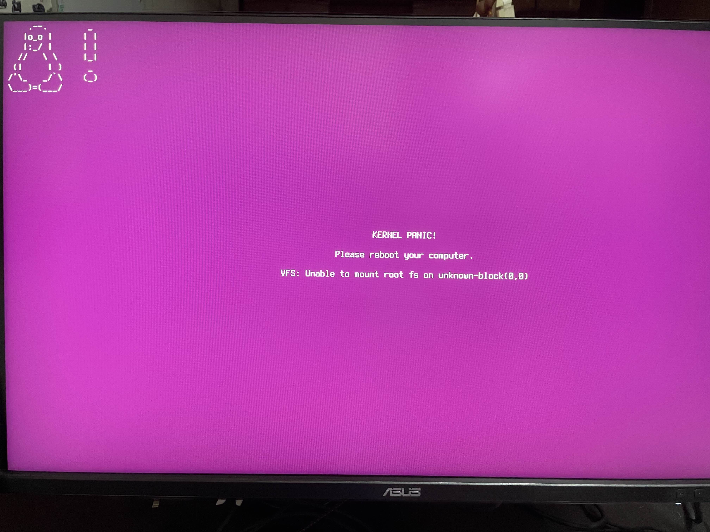

# Ubuntu半年使用心得
不知不覺使用了半年，原本其實可能這件事會被我忘了紀錄，直到我出遠門回來升級Linux碰到了問題，請看這張圖

一開始很慌阿，丟給幾個有玩Linux，甚至是當主力的朋友，但又因為發生在凌晨3點，跟本沒人醒著，我注意到底下有一行報錯資訊：`VFS: Unable to mount root fs on unknown-block(0,0)`，我直接去瀏覽器搜尋這個問題，馬讓讓我找到[Solution](https://dev.to/dm8ry/fixing-the-kernel-panic-not-syncing-vfs-unable-to-mount-root-fs-on-unknown-block00-error-3ado)

往好的方面想，這再次印證了Linux有問題、報錯就算不知道Solution它也能明確告訴你問題是什麼，那網路也有人碰過或者你是Very Super Ultimate Powerful Linux user，我是說或者你很有經驗，你有辦法透過查詢或者依賴自身知識儲備來對問題進行修復，不像Windows，不穩定的時候隨便碰一下不是性能大幅降低，就是直接BSOD，喔不，好像Windows 12要變成「B(Black)SOD」了，然後上面的報錯碼還是一樣令人無解。

但就推廣Linux方面，我確實也在或多或少對於電腦知識有興趣的人推廣使用Linux，但一方面，Linux本身軟體支援度跟MacOS一樣半斤八兩，甚至很多主流軟體，比如Adobe全家統這類生產力軟體不支援，另一方面，Linux很多軟體的安裝和排錯，也非常依賴指令，縱使圖形話相比以往可以說易用性跟Windows相當，但是不少軟體的安裝和操作依舊依賴指令，這也跟開發團隊對於Linux的適配有關，不能怪Linux。

會有這種環境，也不得不說，大部分會用Linux的本身就是對於電腦和系統知識有著相較普通人有著非常高的程度，部份Linux users也被譽為「極客」，不能說沒有普通電腦使用者會將Linux作為主力，但真的少之又少，即便開始有更多組織與政府政大力擁抱開源活動和套件，但我相信單以辦公用途，Windows/MacOS + office應該仍舊佔據90%以上吧？排除進幾年有Canva的崛起，正式文件應該還是離不開Office，即便以台灣政府來說會要求或希望大部分學校，尤其是公立使用`.odt`這類開源word檔案。

回到這個問題來思考，雖然Linux是個即便錯誤那也是乖乖報錯，你只要能看到報錯訊息基本都能處理的系統，但Linux除了本身使用很依賴使用者能力和指令之外，如果諸如Ubuntu這類非常易用的系統碰到這種Kernel Panic，我相信如果這套用在大部份一般人真的用Linux，可能也不知道怎麼處理，光看到報錯資訊就算真的照著指示重開系統，選錯選項也是進不去系統，無法處理，更多人應該會是嚇到後以為系統壞了，開始重灌。我並不是說這個處置方式有問題，但Linux目前用了半年下，雖然在易用性和相容性上有越來越好，但無論是要執行Windows上常用的工具，或者是碰到錯誤需要debug，甚至是使用門檻，我認為Linux現階段還是難以吸引更多一般使用者來使用。

你問我後悔，要換回Windows嗎？至少現在我依舊不後悔，我也想繼續使用Linux作為我的主力，而且用的還是非常開心，沒有綁手綁腳的束縛，還有對於電腦的更高掌握，只是這次碰到的Kernel panic讓我意識到Linux對於目前大多數普通使用者來說，是不易適應的，也能說明為何Linux使用者絕大多數都是電腦、系統愛好者在使用。