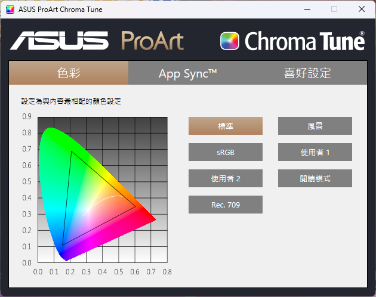
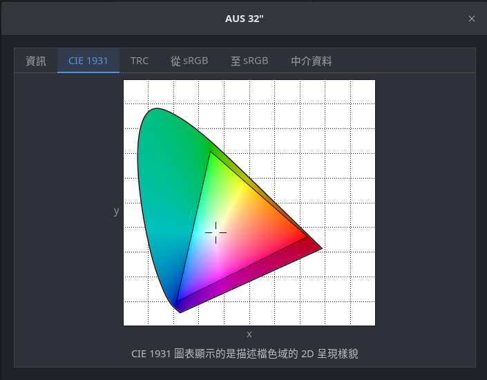

# Ubuntu初入2個月的心得
其實本來上個月就有要寫用1個月的心得，只是剛好太懶沒寫，正好當時也是用Windows最多次的時候，甚至有那幾天沒開過Ubuntu

再接下來第二個月就反轉了，因為幾乎沒玩逃離塔科夫，所以Windows就幾乎沒開，前一個月至少Ubuntu再少也只有1、2天沒開，而這個月Windows可能1個星期才開1次，還是為了玩需用Radmin VPN連線的遊戲，日常使用幾乎沒切換過Windows

正好也在這個拿到了新螢幕，是華碩的ProArt，藉由這個漂亮的螢幕可以看出Windows和Ubuntu的顏色差異，可以發現ProArt在Windows中對於藍色和綠色的範圍更廣，兒Ubuntu則是在紅色色域更廣，個人感覺ProArt在Ubuntu上面顏色上面更漂亮，差距也比較有感

Windows ProArt色域：

Ubuntu ProArt色域：

---
話說回來，Ubuntu日常使用上，個人覺得沒什麼問題，甚至以打遊戲來說問題也沒想像中這麽多，確實有幾款遊戲不容易跑成功，不過個人玩的遊戲剛好大部份不是有原生Linux版，不然就是比較好處理的或者能順利用Proton轉譯的，目前只有逃離塔科夫比較複雜，但還是有順利解決，只是後來VPN的問題，朋友對使用ZeroTier意願較低，且在延遲方面對比Radmin VPN還是沒有優勢，所以碰到需要LAN聯機的遊戲才會切回Windows，剛好第二個月這類狀況大幅下降，所以這個月幾乎都在Ubuntu上度過。

Steam上的遊戲正如前面所說，大部分都能跑，但不是沒遇到問題，首先是Steam的安裝方式，強烈建議從官網下載`.deb`包，**不要從Snap Store安裝**，遊戲檔案找起來變得很麻煩外，甚至有部份原生支持Linux的遊戲（比如鋼鐵雄心4）會變得無法遊玩

至於Proton的部份，有的遊戲第一次運行會導致Vulkan編譯時導致Mutter (Budgie的桌面管理器)發生異常，導致調用比較多顯示需求的程序管理器（內建的GUI查看程序界面和htop）會卡住（只有監控視窗），ChatGPT有提供修復方式，但還沒測試

目前會切換回Windows最主要的原因除了偶爾會用的PS之外，主要是在需要聯機的遊戲，畢竟就算你願意用ZeroTier，別人不一定想用，所以這個算是比較大的阻力，但基本上現在平日會用到的東西和剩下的遊戲都是在Ubuntu上面遊玩，當然我本身對於Windows沒有這麽大的依賴性，高中3年的比賽經驗加上上大學後開使用Macbook可以說在跳到Ubuntu後使用上如魚得水，非常容易上手。

你說我本身有Unix-like系統的使用經驗，那我覺得Linux對於一般人而言會好入門嗎？我的答案是仍舊容易，但是會打指令更優，尤其是你又會玩新硬體的時候，像我手上的Aorus X870 Elite就因為太新了導致Ubuntu 24.04的kernel內沒有有線網卡的驅動，安裝東西如果了解諸如dkpg、rpm等包管理套件那你在安裝上面也會更加輕鬆，但個人覺得最大的阻力還是跳脫舒適圈吧，畢竟除非你一出生就是在有玩電腦系統的家庭，不然絕大部分人從小到大撇除只用過手機的，大部分人從家裡的電腦、電腦店乃至學校電腦都是Windows，少部份人家裡是macOS，但就是不會接觸到Linux，有也是到了大學或著參加體驗營碰碰虛擬機，謹此而已，再加上大部分軟體都只出Windows版本，尤其是專業軟體（比如Soildwork），少部份專業軟體是只for macOS，以及最多就是跨足2大系統（比如Adobe、Office），就是沒Linux的版本，簡單來說就是很跳脫舒適圈，對於大部分人而言它需要的軟體不是沒出Linux版，就是很難在Linux上運行，但人果真的想要Linux都有替代品，比如Office可以用Google和LibberOffice替代，PS可以用GIMP替代，就看你能不能接受而已

你想嘗試跳到Linux?不可否認，虛擬機絕對是個好方法，尤其你在有閒置的主機十這絕對是個更優解，但如果有多的電腦，我認為直接安裝一個Linux系統作為主力系統，先斬後奏的話跳脫機會更高，當然如果你有專業需求，比如你需要畫插圖給廠商，或者需要跑工業軟體，那你在家中有多的電腦可以不用於工作那再裝也沒關係，當然如果體驗累了或者就是用不習慣Linux想灌回去Windows或者使用Mac也不會有問題，畢竟自己的電腦最重要的就是自己用的順手就好，沒有完美的作業系統，只有最適合自己的作業系統。
