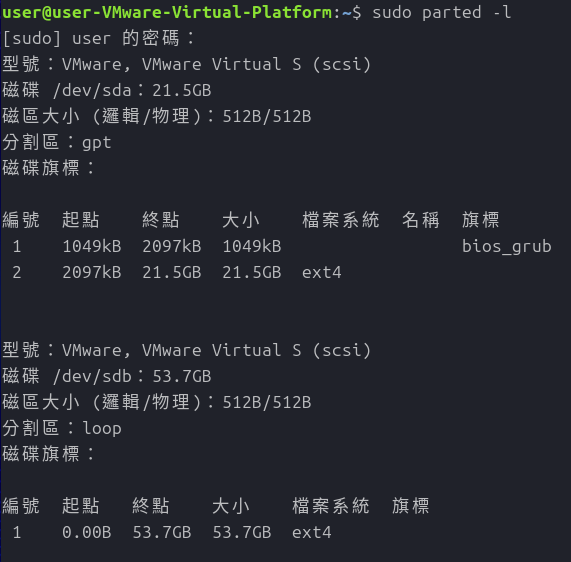
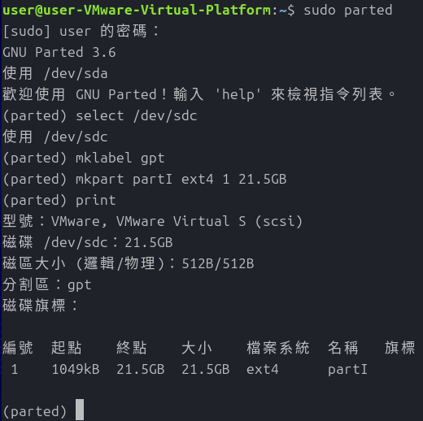
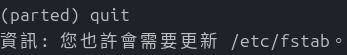
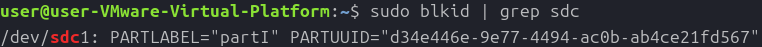
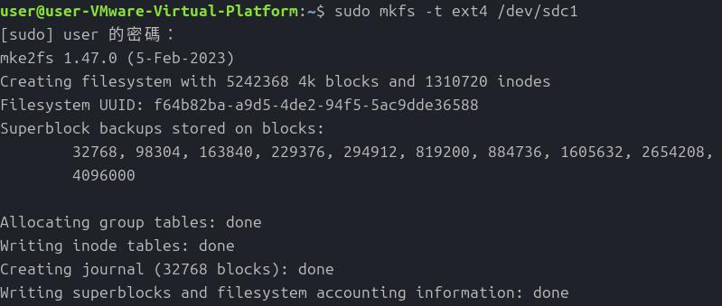
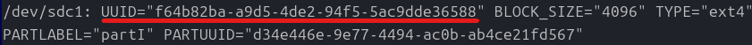
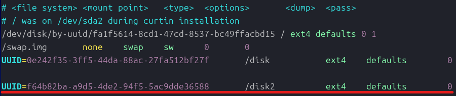

# Linux 硬碟分區、格式化與掛載
這裡的磁碟分區、格式化與掛載主要是系統安裝完成後在終端機操作的，如果是系統安裝過程的分區與格式化則依據做一系統不同而有所差異

這裡使用以Debian體系為主的指令進行操作

[toc]

# 硬碟分區
磁碟的分區工具使用`parted`

在終端機中輸入`sudo parted -l`可以列印出所有磁碟，可以參考這張圖

如果要開始操作`parted`來替硬碟進行分區的話直接`sudo parted`就進入磁碟分區工具了

這裡我新增了一個`/dev/sdc`，若要對這個磁碟進行分區操作首先輸入`select /dev/sdc`進入這個硬碟

```
上述2個動作可以用`sudo parted /dev/sdc`來縮減成一個動作
```

然後使用`mklabel`就可以建立見烈祠碟分區表，一般情況下都是使用`gpt`這類磁區標記即可

設定完成磁區標記後，可以使用`print`確認，接下來就是建立磁碟分區了

建立磁碟分區使用`mkpart`這個指令，這個指令有著固定的格式:
```bash
mkpart [name] [file_system] [start] [end]
```

當然直接打`mkpart`也可以，也會照著上面參數的順序詢問你的設定

下面就是我打指令的過程，可以參考

- 補充:
如果分區表使用msdos的話那`name`會變成`Partirion type`，一個系統只能有4個primary，剩下的只能為`extended`
```bash
Partition type?  primary/extended? primary
File system type?  [ext2]?
Start? 1                
End? 10000
```

完成後就可以輸入`quit`進行格式化，離開時會有一串訊息，該訊息裡`/etc/fstab`是一個Linux啟動時自動掛載磁碟的地方



# 硬碟格式化
在格式化之前，我們可以使用`sudo blkid`查看硬碟的資訊，當完成磁碟分區的硬碟在查尋會有一個PARTID，代表這個硬碟已被分區過，然後給予編號

以sda為例，使用該指令時sda會有sda1和sda2，代表該硬碟被切分程了2個，分別對應在`parted`內編號1和編號2的磁區

我們剛剛處理sdc，此時可以看到我們能查到sdc1的磁碟



確認完是否有建立分區並被系統識別後，接著可以使用以下指令來進行格式化

```bash
sudo mkfs -t [file_system] [partition]
```

一般來說在Linux上file_system會使用ext4，然後partition就選擇`/dev/sdc1`，執行過程如下:

此時可以再用`blkid`確認sdc1是否有UUID


# 硬碟掛載
格式化完成了再來就是硬碟掛載了

在你要掛載磁碟的地方建立新目錄，比如這次我建立在`/disk2`

目錄建立完成後就可以來編輯`/etc/fstab`，格式如下(和參考圖)
```bash
# /etc/fstab

...

UUID=[partition]    [directory]     [file_system]       defaults        0
```


此時儲存離開後每次重開機就會自動掛載

如果要不重開機馬上掛載就輸入`sudo [directory]`然後依照提示輸入`sudo systemctl daemon-reload`就完成了

# Refernce
[gtwang Linux 的 Parted 指令教學：建立、變更與修復磁碟分割區](https://blog.gtwang.org/linux/parted-command-to-create-resize-rescue-linux-disk-partitions/3/)

[How to Create Partitions in Linux](https://phoenixnap.com/kb/linux-create-partition)

[Linux File System: Types, Features, Limitations](https://phoenixnap.com/kb/linux-file-system#ftoc-heading-15)

