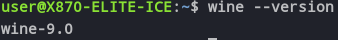
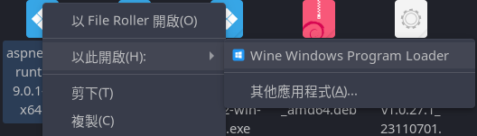
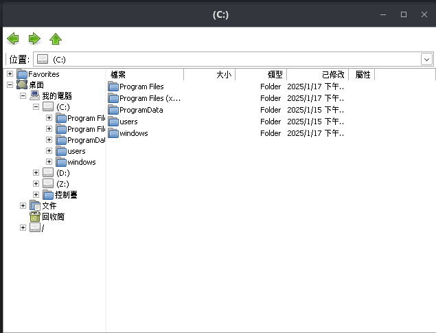

# Wine的安裝與使用

[toc]

# Wine如何安裝
Wine的安裝方式我是參考[How to Install Wine on Ubuntu]的Install Wine From the WineHQ Repository的部份
我也有嘗試直接從Ubuntu官方APT庫安裝wine，執行起來有問題

## 將WineHQ的官方來源
現在的系統都是64位元，在Ubuntu上APT或者說dpkg預設是關閉32位元的套件安裝，如果要能使用完整Wine的功能，需要將32套件包的安裝功能開啟
```bash
sudo dpkg --add-architecture i386
```

接下來從WineHQ官方取得APT key並加入到APT key列表
```bash
wget -O - https://dl.winehq.org/wine-builds/winehq.key | sudo apt-key add -
```

再來將WineHQ加入APT來源庫就可以從官網安裝Wine了
```bash
sudo add-apt-repository 'deb https://dl.winehq.org/wine-builds/ubuntu/ jammy main'
```

## 安裝Wine
例行公事，更新APT來源庫
```bash
sudo apt update
```

因為是從WineHQ官方取得Wine，所以使用以下指令安裝：
```bash
sudo apt install --install-recommends winehq-stable
```

安裝完成後就可以使用`wine --version`檢測是否安裝成功以及版本多少

如果要更新Wine就用以下指令：
```bash
sudo apt upgrade winehq-stable
```

# Wine如何使用
## 淺談Wine的特性
Wine的全稱為「Wine Is Not an Emulator」，所以在運作上它只是充當軟體的轉譯層，讓Windows的程式可以在Linux上執行，而不是類似VMware這類虛擬化的應用，因此如果使用Wine執行Windows病毒是可以造成Linux系統的損毀的

## 最基本的Wine使用方法
其實使用方式還蠻簡單的，只要在終端機輸入`wine [path]`就可以用了

Wine安裝完成後也會自動註冊應用關聯，可以右鍵exe使用Wine運行

如果運行的安裝程式，那安裝完成它會自動在桌面上建立捷徑

但是運行的是安裝檔，那安裝的東西會到哪裡呢？

## What is WINEPREFIX
Wine儲存資料的地方稱為WINEPREFIX

Wine初次使用時，會在家目錄建立`.wine`這個資料夾存放資料，其內部會存放諸如註冊表、硬碟資訊、模擬的C槽等資訊，而你安裝的東西預設也是存放在這裡面

Wine預設有`C:`和`Z:`，前者是模擬的Windows系統碟環境，後者為Linux的根目錄

當然WINEPREFIX還有其他設定和用法，具體可以參考[Ivon的文章](https://ivonblog.com/posts/linux-wine-introduction/#5-%E7%90%86%E8%A7%A3wineprefix%E8%99%9B%E6%93%ACc%E6%A7%BD%E7%9A%84%E6%A6%82%E5%BF%B5)

## Wine內建的其他功能
Wine內建部份Windows系統程式，也是使用指令開啟。

以下是透過Wine的指令呼叫出GUI的操作工具，用來設定或使用Wine，當然也可以使用純指令操作，具體參考[Wine wiki](https://gitlab.winehq.org/wine/wine/-/wikis/home)

呼叫系統工具的語法是`wine [tools]`，把`[tools]`改成以下對應的參數即可

- `explorer` : 打開類似Windowns檔案總管的視窗，可以參考剛剛出現的圖片
- `control` : 打開控制台，可以從這裡刪除安裝在Wine的程式
- `taskmgr` : 打開工作管理員，Windwos 7 Style，可以查看系統狀況與關掉透過Wine打開的程式
- `notepad` : 打開模擬的記事本
- `cmd` : 在終端機上模擬命令提示字元，僅支持DOS指令

## winecfg - 調整Wine的設定
Wine可以透過輸入`wine winecfg`或者`winecfg`呼叫設定界面

- 應用程式：可以用來調整特定軟體模你的Windows環境
- 函式庫：設定特定函式庫要用Wine內建還是Windows提供的版本
- 儲存裝置：可以在這邊設定Wine掛載的磁碟與對應路徑
- 音效：管理Wine執行時所調用的音效裝置

# Winetricks - 輔助使用Wine小幫手
Winetricks是一個指令稿，可以協助使用者更便於使用與設定Wine

安裝Winetricks：從[官方的GitHub頁面](https://ivonblog.com/posts/linux-wine-introduction/)下載最新板指令稿，並丟到系統指令目錄
```bash
wget https://raw.githubusercontent.com/Winetricks/winetricks/master/src/winetricks
chmod +x winetricks
sudo mv winetricks /usr/bin
```

Winestricks也提供Flatpak的版本，安裝方法[參考這裡](https://ivonblog.com/posts/linux-wine-introduction/#7-%E7%94%A8winetricks%E7%B0%A1%E5%8C%96%E5%AE%89%E8%A3%9D%E4%B8%AD%E6%96%87%E5%AD%97%E9%AB%94%E6%B5%81%E7%A8%8B)

Winetricks的使用方式很簡單，只要在終端機上輸入`winestricks`就會呼叫簡單的GUI，可以根據上面的功能來使用

# Wine字形缺失
我一開始剛裝完Wine的時候使用`winecfg`時點到顯示發現螢幕解析度底下的文字都是框框，執行Windows軟體時也是各種框框，很明顯這就是字形缺失

處理方式也很簡單，透過Winetricks安裝`cjkfonts`就可以解決

# Reference
[How to Install Wine on Ubuntu](https://phoenixnap.com/kb/how-to-install-wine-on-ubuntu)
[Ivon - 「Wine」指令使用教學，在Linux系統跑Windows exe軟體](https://ivonblog.com/posts/linux-wine-introduction/)
[linux wine 請記得使用winetricks安裝字型](https://kafeiou.pw/2021/08/12/3337/linux-wine-%E8%AB%8B%E8%A8%98%E5%BE%97%E4%BD%BF%E7%94%A8winetricks%E5%AE%89%E8%A3%9D%E5%AD%97%E5%9E%8B/)
