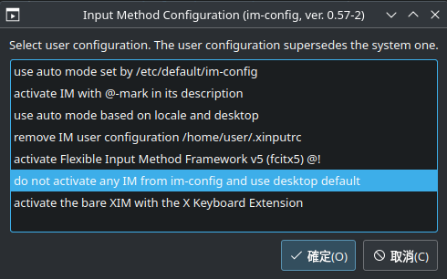

# 甘於我切換到Kubuntu的那些事
我今年1月正式把主力從Windows轉移至Ubuntu，當時選擇的是Ubuntu-Budgie，結果不到1年，我就把我的Ubuntu-Budgie 24.04 LTS重灌成了Kubuntu 24.04 LTS。

當我在紀錄這篇心得的時候，我已經使用Kubuntu 24.04一週了，這裡有些心得。（小插曲：重灌的時候忘記把書籤匯出也沒開同步，一堆本子消失了（悲））

## EFI分區移動與修復卡99
如果有仔細看我在GitHub的Commit紀錄，可以看到我額外開了其他記事，然後裡面是Windows EFI分區移動吧，我又多了一個討厭Windows的理由，那就是安裝時看到EFI分區問也不問直接塞入，然後安裝完還會直接修改開機順序，直接無情強行插入我的Linux EFI分區，當初就有注意到了，但是要重灌並且做系統隔離才發現痛苦...

我把新的EFI分區和Windows boot manager作到Windows系統碟上後，我重新開機測試時就發現開機時間變很久，我看了我的X870 Elite上面的除錯燈發現除錯碼卡99 (Super I/O 初始化)，~~螢幕成功點亮~~阿不是，是我的ProArt左上角出現很像游標的東西，卡了大概5秒後閃現一下大雕Logo馬上就是喜聞樂見的「Windows自動調整開機順序」，反正馬上就要重灌Kubuntu，這也無妨。測試完成後我就切回Ubuntu馬上執行`sudo rm -rf /boot/efi/EFI/Microsoft`，這樣做是沒錯的，但是接下來還要分別執行`sync`然後再`sudo umount /boot/efi`(如果可以的話)，最後再來檢查EFI的狀態，使用`sudo fsck.vfat -v [EFI_PART]`，當然`rm`之後的後續步驟我沒驗證過，或許有用，我做完移除舊的Boot Manager後就直接關機了，如果後續真的需要在再重建EFI分區和開機檔，我建議直接在Linux使用`sudo efibootmgr -b $BOOT_ORDER -B`或在Windows上用`bcdedit /enum firmware`找到原本的Boot manager再輸入`bcdedit /delete {identifier}`把原本的Windows boot manager刪除，Gemini 3 Pro挺聰明的，接下來修復卡99的步驟都是Gemini 3 Pro褓姆級教育來幫我修復的，親測有效。

1. 檢查EFI分區，並確認boot loader、boot manager在的EFI分區有沒有對應或者有不該出現的分區
   ```bash
   # Check Boot manager on EFI
   sudo efibootmgr
   
   # List Disk Part
   lsblk -o NAME,SIZE,FSTYPE,PARTUUID,MOUNTPOINT
   
   # 如果有不該存在的boot manager，直接刪除
   sudo efibootmgr -b $BOOT_ORDER -B
   ```

2. 如果EFI沒問題或者已經把該刪除的都刪掉就執行以下操作
   ```bash
   sudo fsck.vfat -v -a /dev/nvme2n1p3
   ```
   如果像是底下輸出，就代表EFI分區有問題（比如像我暴力硬刪Boot manager或是主機板發現有2個EFI分區導致開機異常）
   ```
   /dev/$EFI_PART

   fsck.fat 4.2 (2021-01-31)
   
   Checking we can access the last sector of the filesystem

   There are differences between boot sector and its backup.

   This is mostly harmless. Differences: (offset:original/backup)

    65:01/00

    Not automatically fixing this.

   Boot sector contents:

   System ID "mkfs.fat"

   Media byte 0xf8 (hard disk)

         512 bytes per logical sector

        4096 bytes per cluster

          32 reserved sectors

   First FAT starts at byte 16384 (sector 32)

           2 FATs, 32 bit entries

     1101824 bytes per FAT (= 2152 sectors)

   Root directory start at cluster 2 (arbitrary size)

   Data area starts at byte 2220032 (sector 4336)

      274658 data clusters (1124999168 bytes)

   32 sectors/track, 64 heads

        2048 hidden sectors

     2201600 sectors total

   Reclaiming unconnected clusters.

   Dirty bit is set. Fs was not properly unmounted and some data may be corrupt.

   Automatically removing dirty bit.

   Checking free cluster summary.


   *** Filesystem was changed ***

   Writing changes.

   /dev/nvme0n1p1: 13 files, 1987/274658 clusters
   ```
   這個操作主要是檢查有沒有Dirty bit和開機磁區是否一致，像我這個就出現了以下幾個問題：
   - `Dirty bit is set`: 分區狀台沒被紀錄或者沒有正確卸載磁區導致Dirty bit標記。
   - `There are differences between boot sector and its backup`: 啟動磁區和備份不一致，這會影響主機板開機的Post過程與時間。
   
   檢查出問題後會簡單修復一些問題

3. 這時如果直接重開機可能還是會卡`99`，我就是這樣，所以建議再來做個交互修復，輸入`sudo fsck.vfat -r /dev/$EFI_PART`，基本上會問你`Perform changes? (y/n)`和`Update backup boot sector?`，直接按`y`即可

4. 關機後不要開機，斷電按住開機按（機殼或是主機板的都可以），按住10~15s，聽起來很玄學，但這樣做（Gemini 3 Pro說）可以把主機板的殘存的電流放掉，讓主機板的Super I/O和南橋晶片放電，透過放電讓晶片把主機板的開機磁區狀態忘掉，~~不管Gemini 3 Pro說的對不對反正~~親自測試有效果，不做只做到第三驟還是會卡99，然後要再重複執行第三步把Dirty bit清掉。

### 預防勝過修復
如果各位還有想要安裝雙系統的，要麼你先安裝Windows，要麼你裝完Linux後尤其希望Windows不能染指你的作業系統，除了盡量避免使用Ext4Fsd或winBTRFS，如果你希望微軟不能污染你的Linux EFI分區或者想像我一樣做硬碟隔離的，在安裝時用盡一切手段不要讓你的Windows能夠掃描到你Linux的EFI，比如物理拔除，或者像我這種高階主機板有導熱貼不好拔的可以透過BIOS或者在安裝前透過快捷鍵打開CMD把你的Linux系統碟隔離。

## 從Mutter到Kwin，從X11到Wayland
其實在用Ubuntu-Budgie一段時間後看到KDE Plasma稍做設定可以使用Wallpaper Engine就有點心動了，又看到KDE Plasma的可自訂程度很高又更新動了，所以決定換了顯示卡（要買的時候一直被XX屋卡住，e04su3su;6ru 19 ）就來重灌Kubuntu 24.04 LTS，就在我寫文章(12/9)的上上個週五我的提前買的新卡PowerColor RX9070XT Hellhound Spectral White到貨了，本來要等RTX 5080 Super買個24G大VRAM，結果DRAM產能全被AI公司買走...，連帶影響我訂卡那周AMD宣佈12月全系列調漲10%，NVIDIA宣佈由AIC自行採購GDDR7...總之話說回來，在下訂後我很早之前就把Kubuntu 24.04.2 LTS放入到Ventory USB裡面，結果要用發現好像又壞了...，要去Kubuntu官網檢查結果發現Ubuntu因為HWE(Hardware Enablement)的關係已經更新到了Kubuntu 24.04.3，安裝並複製到Ventory USB後跑完檔案驗證，沒問題我就透過LiveCD打開Kubuntu 24.04.3 LTS，我感受到全新的世界，是一個比我Ubuntu-Budgie和Windows流暢的世界，所以這次更新讓我的RTL8125終於不用先用無線網路安裝Ethernet的dkms了，所以這次的安裝體驗也做到了真正的開箱使用。

在此次安裝由於我遊戲碟也使用BTRFS，所以我也有研究BTRFS除了更方便讓Windows可以透過開源驅動讀取外，也研究了BTRFS的特性，發現BTRFS不只要給系統設定快照更容易也更省空間，它還支持整個檔案系統的壓縮，這在現在2025年底寸G寸金，普通NAND Flash SSD比Apple這黃金做的儲存空間還貴的時代是不可多得阿！我下次再來寫寫BTRFS在Ubuntu上的設定心得吧，不做設定不只不能發揮優勢，反而會傷SSD。

其實Kubuntu 24.04有點尷尬，在功能凍結的時候因為KDE Plasma 6剛出，所以在這個求穩的發行版最後還是已經老熟的KDE Plasma 5作為Kubuntu 24.04的桌面環境，這帶來的損失就是極致的Wayland體驗，作為AMD全家桶的高級使用者，這還是有點可惜，因為KDE Plasma 5雖然支持Wayland，但屬於是實驗性的，但是之前在Ubuntu-Budgie時期隨著我把顯示卡從1660S更換成RX 7600以及一次次的系統更新和遠端桌面的慘況，我感受到X11 + ext4讓我正式把Linux作為日場主力系統時吃進了苦頭（比如遠端桌面把我桌面搞爛，更新後玩遊戲反而不穩定，遊戲不穩定把我整個桌面帶走等...），再加上AMD的全開源驅動天生很適合Wayland，所以我還是決定使用Wayland session，如果要在KDE Plasma 5啟用Wayland session需要使用以下指令安裝，安裝完後就可以在登入界面的左下角切換工作階段：
```bash
sudo apt update
sudo apt install plasma-workspace-wayland
```
當然換桌面環境無非就是可能在使用習慣上類似Windows換成MacOS之類的單純操作邏輯的轉換，但是把圖形平台從X11換成Wayland不單單只是從虛幻4變成虛幻5這種畫面渲染的更替，而是直接把整個GUI無論是渲染方式還是不同視窗與組件的交互邏輯都大改變了，比如輸入引擎從X11的im-config變成直接由Kwin (視窗管理器)接管

### Wayland輸入法設定
如果你也是AMD顯示卡使用者或至少不是使用NVIDIA的顯示卡，那在KDE Plasma 5使用Wayand是個不錯的選擇，如上面所說，要先安裝Wayland工作階段：
```bash
sudo apt update
sudo apt install plasma-workspace-wayland
```
安裝完後你會碰到一個問題是你完全輸入不了中文，這時你就要設定虛擬鍵盤和輸入法引擎。

首先是虛擬鍵盤，打開系統設定，左邊選單往下拉，找到硬體 -> 輸入裝置，點進去後找到虛擬鍵盤，選`Fcitx 5`，不要選旁邊的Fcitx 5 Wayland Launcher


Wayland會把輸入法引擎作為虛擬鍵盤直接操作，但在X11下Ubuntu使用的是`im-config`用來控制輸入法引擎，此時要把`im-config`關閉，避免2個地方同時呼叫輸入法引擎。在終端機輸入`im-config`，跳出視窗後選按確定，然後Yes，選擇"do not set activate any IM from imconfig and use desktop default"



最後，有的程式可能會運作在XWayland上，尤其是基於Chromium/Electron寫的程式，如果真的碰到有的程式在Wayland下無法打字，可以試著在程式的啟動參數/引數（開始選單 -> 找到無法切換輸入法的程式 -> 右鍵 -> 編輯應用程式 -> 應用程式）加入`--enable-features=UseOzonePlatform --ozone-platform=wayland --enable-wayland-ime`，這樣就能打字了

# Reference
[ask Ubuntu - What is hardware enablement (HWE)?](https://askubuntu.com/questions/248914/what-is-hardware-enablement-hwe)
[Fcitx 5 - Using Fcitx 5 on Wayland](https://fcitx-im.org/wiki/Using_Fcitx_5_on_Wayland#KDE_Plasma)