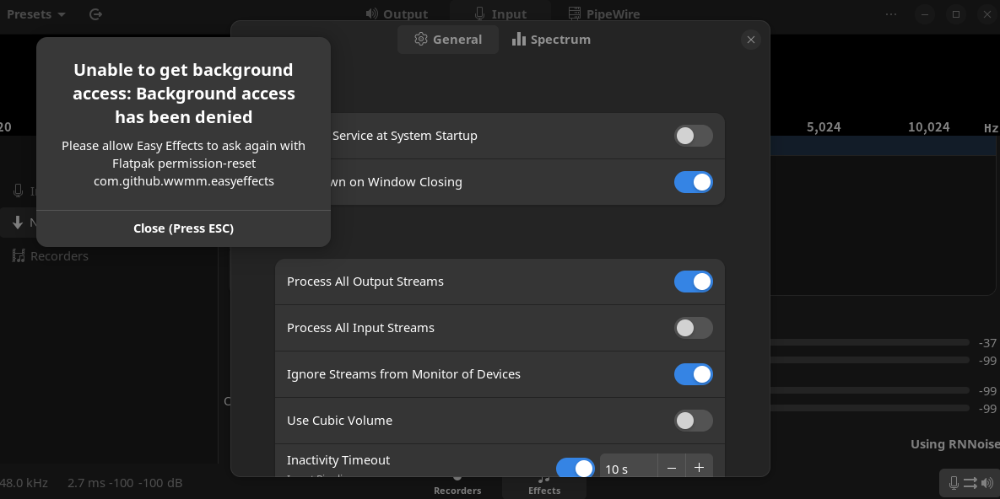

# Ubuntu 22.04麥克風降噪採坑全紀錄
撰寫這篇文章的時候，正好用了Ubuntu一個星期，正好在這2天分別採了兩大坑，分別是Linux ARGB Control和麥克風降噪處理，前者根據爬文和現況決定暫且放棄，等OpenRGB更新，後者的話既然你看到這片文章，代表我成功了，接下來慢慢來看我的採坑過程吧。

[toc]

# 找尋方案
我的麥克風是AM310，Ubuntu能順利的識別，但是官方的麥克風控制程式只提供Windows版，裡面有個我換麥克豐厚很常用的功能：雜音去除。我嘗試使用Wine安裝並運行，雖然能順利讀到麥克風，但是聲音判斷不正常，很顯然Wine碰到硬體交互的問題必定存在侷限性，我也不是很意外。

因此我開始嘗試搜尋別人在Ubuntu上實做降噪，剛好在巴哈的[這篇文章](https://forum.gamer.com.tw/C.php?bsn=60030&snA=632795)和[其他地方](https://yuehhua.github.io/2020/09/06/linux-system-noise-cancellation/)看到有關於Linux如何與音訊設備交互，所以我根據發行板與版本號碼去尋找方案，最終確認Ubuntu 24.04基本與PluseAudio無關，純PipeWire，因為`pactl`無法使用

在搜尋的過程中剛好看到[ask Ubuntu上的帖子](https://askubuntu.com/questions/1464667/pipewire-noise-cancellation-kubuntu-23-04)，這篇帖子可以說提供了保底方案，這也剛好吻合我的搜尋方向：PipeWire的實時降噪模組，因為PluseAudio正是以這種形式完成降噪。

其實後面的坑完全是我多踩的，我找到這篇文章後照著下面的Solution做一遍就可以馬上用了，但是從它裡面所提供的Docs我都翻了一遍後，除了可以確定這確實是基於PipeWire開發的降噪插件，另一方面，[GitHub頁面](https://github.com/werman/noise-suppression-for-voice)也提供了另外2個常見的套件。

# Easy Effects
我首先看上了EasyEffects，這是針對PipeWire所設計的音效控制軟體，功能相當齊全，如果是對喇叭的音色不滿意，可以參考[這篇文章](https://ivonblog.com/posts/linux-easyeffects/)，適合不想花大量時間調音的人

而如果想要用EasyEffects進行麥克風降噪也很簡單，選Input然後在Effect內增加Noise Reduction和Deep Noise Remover後，除了根據需求微調，在設定裡面直接句選套用所有應用程式即可，聽起來很完美，但是問題就出在EasyEffects上本身，透過APT安裝的缺少[RNNoise](https://github.com/xiph/rnnoise)，所以無法降噪，Effect加了等於沒加，官方有提供Flatpak版本，安裝了有模組，但是不能在背景運行和開機自啟，嘗試透過Flatseal和閱覽官方manual來解鎖權限，結果都動不了

之後Easy Effects的問題如果找到解決方法，我會再跳回使用Easy Effects，畢竟控制項目相當齊全，如果對自己的外放音色不滿也可以用這個調整。

依照目前的官方指引，Easy Effects也會建立一個虛擬音訊來源，不要選

# NoiseTorch
NoiseTorch的GitHub頁面[在這](https://github.com/noisetorch/NoiseTorch)，只提供降噪功能，安裝與設定最快，但同樣不能開機自啟，須手動開啟。

# PipeWire降噪插件
以下PipeWire降噪插件參考[這個帖子](https://askubuntu.com/questions/1464667/pipewire-noise-cancellation-kubuntu-23-04)和官方GitHub [Readme](https://github.com/werman/noise-suppression-for-voice?tab=readme-ov-file)結合而成

根據官方文獻，你的麥克風採樣律**必須是48khz**，AM310的採樣律正好在48khz，所以不用額外設定

首先先在官方的[下載頁面](https://github.com/werman/noise-suppression-for-voice/releases)下載`linux-rnnoise.zip`，下載完直接解壓縮，把裡面的`ladspa`移動到`/usr/lib`
```bash
mv ~/Downloads/linux-rnnoise/ladspa/ /usr/lib
```

接著在`~/.config`底下建立`pipewire/pipewire.conf.d/`
```bash
mkdir -p ~/.config/pipewire/pipewire.conf.d/
```

然後在裡面建立`99-input-denoising.conf`這個膽暗，檔案內容如下：
```bash
context.modules = [
{   name = libpipewire-module-filter-chain
    args = {
        node.description =  "Noise Canceling source"
        media.name =  "Noise Canceling source"
        filter.graph = {
            nodes = [
                {
                    type = ladspa
                    name = rnnoise
                    plugin = /usr/lib/ladspa/librnnoise_ladspa.so
                    label = noise_suppressor_mono
                    control = {
                        "VAD Threshold (%)" = 50.0
                        "VAD Grace Period (ms)" = 200
                        "Retroactive VAD Grace (ms)" = 0
                    }
                }
            ]
        }
        capture.props = {
            node.name =  "capture.rnnoise_source"
            node.passive = true
            audio.rate = 48000
        }
        playback.props = {
            node.name =  "rnnoise_source"
            media.class = Audio/Source
            audio.rate = 48000
        }
    }
}
]
```

完成後重起PipeWire
```bash
systemctl restart --user pipewire.service
```

如果沒有動以上設定的話，你的輸入裝置會出現`Noise Canceling source`，這個就是經過降噪處理的音源

內部的細項射的可以參考[官方GitHub](https://github.com/werman/noise-suppression-for-voice?tab=readme-ov-file)

# Reference
[ask Ubuntu - Pipewire Noise Cancellation kubuntu 23.04](https://askubuntu.com/questions/1464667/pipewire-noise-cancellation-kubuntu-23-04)
[【心得】Linux 出專欄啦！！！（15）： Pipewire 全作業系統最強視音訊串流，linux 不需要voicemeeter](https://forum.gamer.com.tw/C.php?bsn=60030&snA=632795)
[Ivon - Linux電腦音質提昇軟體 ～ Easy Effects，拯救破喇叭](https://ivonblog.com/posts/linux-easyeffects/)
[Easy Effects Docs](https://wwmm.github.io/easyeffects/)
[GitHub - RNNoise](https://github.com/xiph/rnnoise)
[GitHub - NoiseTorch](https://github.com/noisetorch/NoiseTorch)
[GitHub - Real-time Noise Suppression Plugin](https://github.com/werman/noise-suppression-for-voice?tab=readme-ov-file)