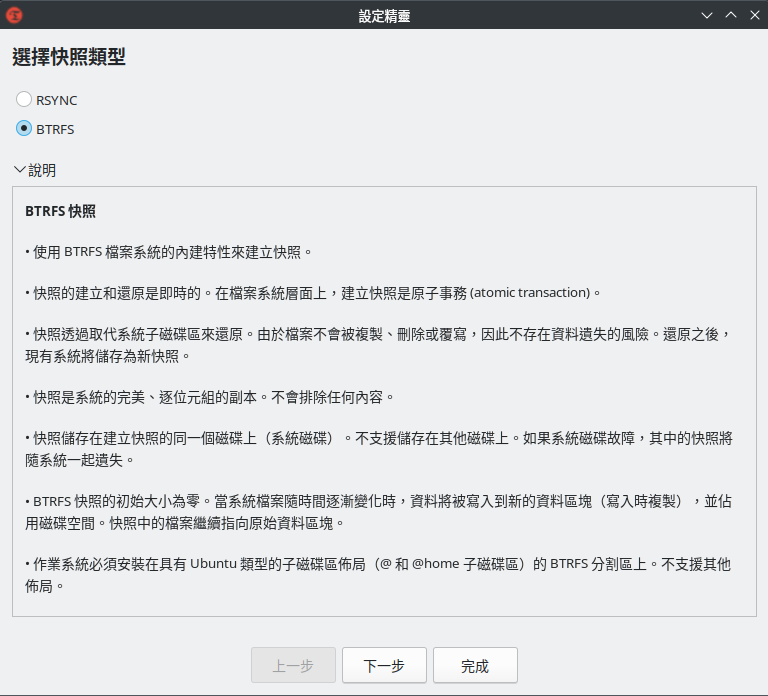
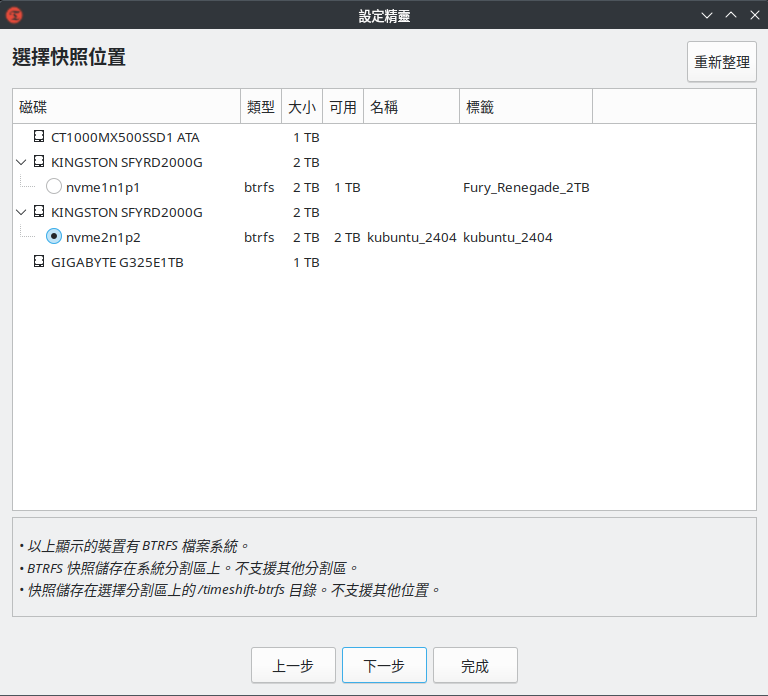
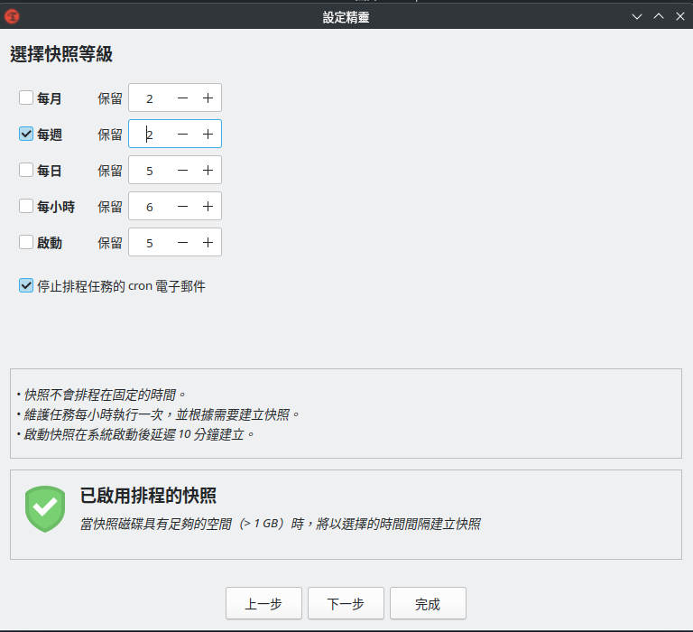
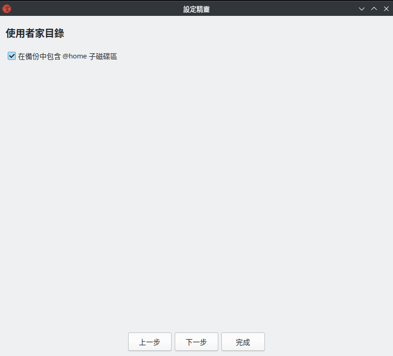
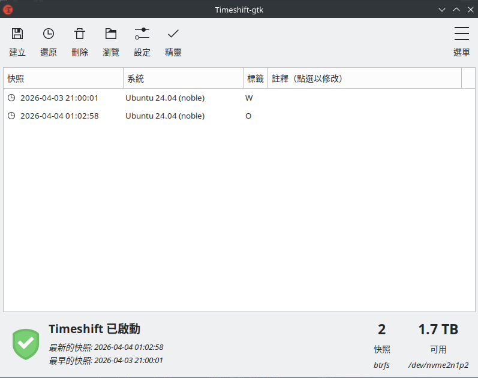

# TimeShift BTRFS模式安裝與設定


Timeshift是Linux用於建立系統還原點的套件，用起來就像是界面陽春點的Time Machine，如果Root FS非BTRFS，那Timeshift幾乎是唯一選擇。如果是Ubuntu/Mint Linux，那子卷預設的佈局也很適合Timeshift。

Timeshift有兩種模式，Rsync和BTRFS模式，Rsync模式直接看[Ivon的文章](https://ivonblog.com/posts/linux-timeshift-usage/)即可，他寫的很簡單且該有的都有。<br/>
我則會著重在BTRFS模式下設定Timeshift。

不過就算你是BTRFS且符合要求，你也可以使用Rsync模式，Rsync模式就真的是界面陽春的Time Machine了，想要一模一樣的體驗(異地備份系統)選它就對。

# 安裝Timeshift與要求
## 環境要求
用BTRFS模式設定Timeshift請確保以下幾點
- 系統被切成`/@`(存放系統根目錄)和`/@home`(使用者家目錄)放在Root Subvolume(ID5)這種子卷布局
  
  檢查方式：
  ```bash
  grep -E '^[^#].+/\s+btrfs' /etc/fstab | \
  grep -oE 'subvol=[^,]+' | \
  cut -d= -f2 | \
  grep -qE '^/?@$' && \
  echo 'OK' || \
  echo 'Not OK'
  ```
  
- Swapfile不在`/@`和`/@home`底下(會提示`Text file busy / btrfs returned an error: 256 / Failed to create snapshot`錯誤)

  官方建議Swapfile丟在獨立子卷(比如`/@swap`)或分區

- Default Subvolume必須是根目錄(ID 5)
  
  驗證方法:`sudo btrfs subvolume get-default /`<br/>
  理想輸出：`ID 5 (FS_TREE)`

## 安裝Timeshift
Debian / Ubuntu:
```bash
sudo apt update
sudo apt install timeshift
```

Arch:
```bash
sudo pacman -S timeshift
```

Fedora (Fedora預設的BTRFS佈局不支援Timeshift，需要自行調整):
```bash
sudo dnf update
sudo dnf install timeshift
```

# Timeshift初始化
剛安裝好Timeshift後要選擇快照類型，如果你是用BTRFS且上面的條件你都符合，就可以選BTRFS模式<br/>


選擇BTRFS模式後快照只能存在系統分割區(選擇其他分區會提示要有根子磁碟區`@`的提示)，直接選系統分區即可<br/>


接下來是系統排程，預設是每日，考量到不會每天更新系統，所以設為每週，並把快照數量減少為2，避免太多快照導致檔案不能被釋放<br/>


Timeshift官方是建議使用者家目錄不做快照，避免系統還原時，家目錄上的文件和、下載等資料也被還原，但是考量到有時候系統有問題就是dotfile改爛(比如設定KDE Plasma主題結果特定設定有Bug)，所以我這裡有勾起來(當然也可以不勾，看需求)<br/>


好了，設定到這裡，Timeshift精靈就沒事情了，他會開始依照你的設定做定期快照，接下來可以來看看Timeshift的界面了，我只能說非常簡單，樸實無華 <br/>


這裡的標籤指的是快照建立的方式，有以下這些標籤：
- `O`：手動建立快照(按右上角的建立)
- `B`：啟動時建立
- `H`：每小時建立
- `D`：每日
- `W`：每週
- `M`：每月

為了證明Timeshift有利用BTRFS的特性來建立快照，我們來驗證一下：
```bash
user@user-X870-Elite-Ice:~$ sudo btrfs subvolume list /
ID 256 gen 178984 top level 5 path @
ID 257 gen 178984 top level 5 path @home
ID 258 gen 177489 top level 5 path @swap
ID 259 gen 35 top level 256 path var/lib/portables
ID 261 gen 17337 top level 256 path var/lib/machines
ID 262 gen 177593 top level 5 path timeshift-btrfs/snapshots/2026-04-03_21-00-01/@
ID 263 gen 171089 top level 5 path timeshift-btrfs/snapshots/2026-04-03_21-00-01/@home
ID 264 gen 177593 top level 5 path timeshift-btrfs/snapshots/2026-04-04_01-02-58/@
ID 265 gen 171088 top level 5 path timeshift-btrfs/snapshots/2026-04-04_01-02-58/@home
ID 266 gen 177593 top level 5 path timeshift-btrfs/snapshots/2026-04-10_21-00-01/@
ID 267 gen 173508 top level 5 path timeshift-btrfs/snapshots/2026-04-10_21-00-01/@home
```

# Timeshift的侷限
## 備份理念
由於其設計理念上更偏向於MacOS的Time Machine，所以TimeShift特別強調和建議快照要用Rsync模式放在其他硬碟，避免系統碟損壞導致無法恢復。<br/>
那為甚麼BTRFS下並不能這麼做？因為BTRFS的CoW特性讓建立快照變成原子事務(Atomic Transaction)，實現方式是直接對整個`/@`做Snapshot，並且其CoW特性讓這件事變成瞬間完成並且不增加硬碟佔用。如果跨磁區會讓瞬間完成和不增加硬碟佔用的特性失效(即使可以用去重但是不可避免的一定會在其他硬碟有至少一個系統大小的佔用)。<br/>
BTRFS即使現在越來越主流，但對比Ext4使用率還是有段差距，並且TimeShift本來就有基於Rsync模式的跨硬碟備份，特地為了BTRFS設計一套專屬的跨硬碟備份模式徒增開發成本且同質性太高，你可能會跟我說「BTRFS有Send/Recive阿，用這個也能大幅縮短快照傳輸時間」，但TimeShift是要做好幾個備份，Send/Recive只能做到對單一子卷的增量傳輸，而且Rsync也能作到一樣的效果，所以回到同質性和開發/維護成本的問題。

所以BTRFS其實是相對「雞肋」的模式，在TimeShift中，這個更像是一種最後保險，萬一系統真的掛了，你有辦法透過LiveCD掛載系統分區使用TimeShift還原的最後手段，那這顯然有能力規劃子卷和設定不如去用Snapper。<br/>
或者是你今天想安裝一個套件然後有後悔藥，如果這個套件讓你系統怪怪的可以快速重開還原，以及你就是想要能幫系統快照但是你的儲存空間不允許你丟到其他硬碟並且你又剛好用BTRFS安裝系統，那快照速度對比Rsync很有優勢。

## 設定限制
你如果有仔細觀察設定精靈和設定界面，你會發現除了系統排程以外沒有其他地方可以限制你的快照數量，他們只能限制那些Crontab自動執行的快照數量，對於手動建立的快照並不能限制，如果使用者會比較頻繁的手動建立快照，會需要考驗使用者的快照管理能力，如果不管制快照數量會導致硬碟佔用飆升(Rsync)或者碎片化(BTRFS)，且檔案刪除後還會無法釋放空間(Both)，最簡單的方式就是自己訂個數量，`O`的快照數完多過一個數字就把最早的刪掉。

# 企業級還原力
雖然TimeShift侷限比較多，但你真的有心，你還是可以做出類似openSUSE那套企業級的恢復力(BTRFS + GRUB + Snapper + YaST)，TimeShift直接把Snapper + YaST的部份吃掉了，只是快照管理需要使用者更加注意，雖然現在GRUB即將淘汰，但是Debian / Ubuntu體系目前還是GRUB，所以我們會需要安裝[grub-btrfs](https://github.com/Antynea/grub-btrfs) (需要注意這個Debian和Ubuntu需要自己編譯安裝，只有Arch可以直接用AUR)，讓我們可以把快照丟在GRUB上面回滾，這個時候再自己把APT hook + TimeShift + grub-btrfs串在一起，變成一套低成本的企業級回滾方案，開機後系統有問題可以重開機從GRUB回滾系統，這在Ubuntu上(26.04和之前的版本)尤為低成本(預設子卷布局)。<br/>
礙於篇幅我這裡就不展開了，之後獨立寫一篇。

# Reference
- [Ivon's Blog - Timeshift：Linux圖形化備份軟體，備份與還原系統超簡單](https://ivonblog.com/posts/linux-timeshift-usage/)
- [TimeShift GitHub](https://github.com/linuxmint/timeshift)
- [grub-btrfs GitHub](https://github.com/Antynea/grub-btrfs)
