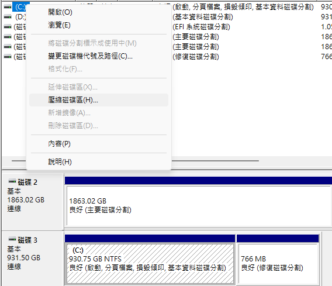
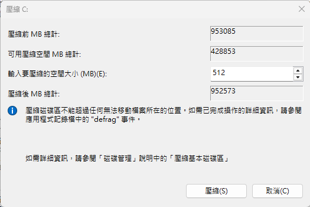

# 移動Windows EFI與離線硬碟
我使用的Ubuntu-Budgie 24.04 LTS因為X11越來越不是和現代的Linux圖形化介面的使用，尤其是遊戲領域，所以我決定重灌Ubuntu，除了換為支援Wayland的系統之外，順便把檔案系統從Etx4更改為BTRFS，體驗Linux上更現代、進階的檔案系統，但我因為先前安裝了winBTRFS，我不希望Windows可以很輕易的訪問我的Linux根目錄，所以我決定讓這顆硬碟在Windows上"離線"。

好傢伙，Windows在安裝時其實並不能隨意地切割硬碟，準確來說是沒辦法控制細項，納在安裝時，EFI分區就是看到哪裡有就往哪裡塞，你也沒機會選擇分區類型(除非你開CMD操作)，所以導致我的EFI裡面同時有Ubuntu和Windows的開機引導檔案，由於這個EFI分區剛好在我要隔離的硬碟(Ubuntu根目錄所在硬碟)，導致我無法把我的硬碟離線，那我只能做比較危險的事情了，那就是搬移Windows EFI檔案。

那在搬移EFI分區到Windows硬碟前，如果Windows有掃描到EFI分區，它會自動把啟動文件塞進去，你如果又是直接點整顆硬碟安裝，應該會像這張圖一樣，整個硬碟都是被分配給C槽的: 

沒救嗎?不，有救!首先對你的`C:`按右鍵，然後選擇`壓縮磁碟區` 

他會先花時間來讀取你的該分區可以把多少容量釋放出來，計算完成後他會跟你說有多少空間可以壓縮(其實是從你的磁區釋放多少空間變成為分配)，一個EFI分區大約有100MB ~ 1G，這裡我就填入個512，不建議EFI分區小於200MB，如圖:


好了，接下來你應該會看到妳的`C:`後面多了一塊未分配區塊，你如果`C:`後面未來會有尚分配區塊需要做延伸但是被EFI分區擋住可以參考[這篇文章](https://jonashogman.com/moving-efi-partition-before-c/)教你如何把EFI分區左移。

總之，拆分出一個新區域後就可以把這個區域就可以開始設定了，但這裡只能用指令`diskpart`來處理了，電腦管理的磁碟管理無法設定EFI旗標。這裡我建議使用Administrator打開CMD，輸入`diskpart`後依序執行以下指令:
```cmd
// 列出你的硬碟找到你的Windows硬碟
list disk

// 找到你的Windows硬碟後選擇Windows硬碟 (假設硬碟編號是3)
select disk 3

// 建立EFI磁區
create partition efi size=512

// 列出分區確認有被成功建立
list partition

// 列出時partition編號前面會有米字號*表示你所選的分區
// 如果不是在EFI分區上面使用`select part `efi_partition_number`選擇EFI分區
// 確定選擇EFI分區後格式化為FAT32
format quick fs=fat32

// 暫時分配一個磁碟編號，用於後續建立Windows Boot Manager
assign letter=X

// 至此可以暫時離開diskpart
exit
```

如果你是用Administrator開啟CMD，你就可以直接在CMD裡面執行以下指令:
```cmd
bcdboot C:\Windows /s X:
```
這個指令會把Windows開機指令正確的複製並設定到新的EFI分區上

接下來重新打開`diskpart`，依據以下指令移除磁碟機編號
```cmd
// 找到你的新EFI分區，Ltr的欄位應該會有你設定的編號，比如這次範例的"X"
list volume

// 選擇你的新EFI的磁碟編號(比如磁碟機3)
select volume 3

// 移除磁碟機代號
remove letter=X

// 最後列出檢查代號
list volume

// 完成後離開
exit
```
完成後就可以重新開機按F12看看有沒有設定完成可以正常引導

# Reference
[Jonas Blog - Moving EFI partition before C:](https://jonashogman.com/moving-efi-partition-before-c/)
